<div align="center"></div>

## <div align="center">Operational Procedure Guide for Vehicle Departure from the Parking Zone</div>
### Parking Lot Exit Overview
- #### Parking Lot Exit program
    1.  **System Startup and Direction Determination (Jetson Orin Nano Responsibility)**
         * When the vehicle starts, the **main control system (Jetson Orin Nano)** performs image recognition via the camera to first **determine the vehicle's default driving direction** (Counter-Clockwise or Clockwise). Subsequently, it identifies and locks onto the **color of the target track line**, which serves as the basis for the entire mission.

    2.  **Counter-Clockwise (CCW) Driving Logic**
        * **Upon detecting a Green Pillar:** The vehicle executes a **90-degree turn to the left** for a lane change, **driving forward to the inner side of the Green Pillar**. Subsequently, the vehicle **turns 90 degrees to the right** and **reverses to a predetermined position** (completing the inner lane change).
        * **Upon detecting a Red Pillar:** The vehicle **drives forward**, then **turns 90 degrees to the left**, **driving forward to the outer side of the Red Pillar**. Subsequently, the vehicle **reverses, turns 90 degrees to the right**, and **reverses to a predetermined position** (completing the outer lane change or avoidance).
        * **When no pillars are detected:** The system defaults the vehicle to **drive on the outer side of the lane**.

    3.  **Clockwise (CW) Driving Logic**
        * **Upon detecting a Green Pillar:** The vehicle executes a **90-degree turn to the right** for a lane change, **driving forward to the outer side of the Green Pillar**. Subsequently, the vehicle **turns 90 degrees to the left** and **drives forward to a predetermined position** (completing the outer lane change).
        * **Upon detecting a Red Pillar:** The vehicle executes a **90-degree turn to the right** for a lane change, **driving forward to the inner side of the Red Pillar**. Subsequently, the vehicle **turns 90 degrees to the left** and **drives forward to a predetermined position** (completing the inner lane change).
        * **When no pillars are detected:** The system defaults the vehicle to **drive on the outer side of the lane**.
- **Code running on the Raspberry Pi Pico W controller.**
    ```python
    # --- Execute rotation based on turn ---
    if turn == 1:
        print("Turning right") # Right turn message
        run_encoder_Auto(500, 45, 180) # Move with encoder and turn
    else:
        print("Turning left") # Left turn message
        run_encoder_Auto(1550, 45, -200) # Move with encoder and turn

    # --- mode 1: Color Decision ---
    mode = 1 # Change mode
    LAST_COLOR = 0 # Reset last color
    color = 0 # Reset color
    print(mode, color) # Debug print
    print('Waiting for color (M,<1..6>[,<...>] or JSON {"color":n})...') # Status message

    while mode == 1 and color == 0: # Loop until color is detected
        json_obj, m_tuple, got_stop = pump_uart(s) # Pump UART for data

        if json_obj:
            v = None # Value variable
            try:
                if "color" in json_obj:
                    v = int(json_obj["color"]) # Get color from JSON
                elif "c" in json_obj:
                    v = int(json_obj["c"]) # Get color from JSON (short key)
            except:
                v = None # Set to None on error
            if v is not None:
                if 1 <= v <= 6:
                    color = v # Set color
                    LAST_COLOR = color # Update last color
                    print("[JSON] color =", color) # Confirmation message
                    break # Break the loop
                else:
                    # Debug print: ignore out of range
                    if DEBUG: print("[IGNORE] JSON color out of range:", v) 
                    extract_magenta_from_json(json_obj) # Update magenta data

        if m_tuple:
            first = m_tuple[0] # First value of M command
            if 1 <= first <= 6:
                color = first # Set color
                LAST_COLOR = color # Update last color
                print("[M] color =", color, "raw:", m_tuple) # Confirmation message
                break # Break the loop
            else:
                # Debug print: ignore M packet
                if DEBUG: print("[IGNORE] M packet in mode1 (not color):", m_tuple) 

        if json_obj is None and m_tuple is None:
                    time.sleep(0.002) # Short sleep if no new data
            
    # --- Color-based actions (Skipped for brevity, same as original) ---
    if color == 1:
        print("Color=1") # Status message
        run_encoder_Auto(1900, 70, 0) # Encoder move
        run_encoder_Auto(1500, 70, 180) # Encoder move
        run_encoder_Auto(1200, -45, 0) # Encoder move
    elif color == 2:
        print("Color=2") # Status message
        run_encoder_Auto(1700, 70, 0) # Encoder move
        run_encoder_Auto(1150, -50, -180) # Encoder move
    elif color == 3:
        print("Color=3") # Status message
        run_encoder_Auto(1700, 70, 0) # Encoder move
        run_encoder_Auto(1150, -50, -180) # Encoder move
    elif color == 4:
        print("Color=4") # Status message
        run_encoder_Auto(600, 40, 180) # Encoder move
        run_encoder_Auto(400, 50, 0) # Encoder move
        run_encoder_Auto(1100, 40, -180) # Encoder move
        run_encoder_Auto(800, 50, 0) # Encoder move
    elif color == 5:
        print("Color=5") # Status message
        run_encoder_Auto(600, 40, 180) # Encoder move
        run_encoder_Auto(2200, 60, 0) # Encoder move
        run_encoder_Auto(1400, 40, -180) # Encoder move
        run_encoder_Auto(500, 50, 0) # Encoder move
    elif color == 6:
        print("Color=6") # Status message
        run_encoder_Auto(600, 40, 180) # Encoder move
        run_encoder_Auto(400, 50, 0) # Encoder move
        run_encoder_Auto(1400, 40, -180) # Encoder move
        run_encoder_Auto(800, 50, 0) # Encoder move

    control_motor(0) # Stop motor
    set_servo_angle(0) # Center servo

    ```
## <div align=center>Counter-clockwise green departure process</div>
<div align=center>
<table>
<tr>
<th width="50%">Step-1: Preparing to turn left</th>
<th width="50%">Step-2: Start_reversing</th>
</tr><tr align=center>
<td width="50%"></td>
<td width="50%"></td>
</tr>

<tr>
<th width="50%">Step-3: Reparing to turn right</th>
<th width="50%">Step-4: Preparing to retreat</th>
</tr><tr align=center>
<td width="50%"></td>
<td width="50%"></td>
</tr>

<tr>
<th>Step-5: Arrive at the designated location</th>
<th>Video Documentation of the Autonomous Vehicle's Actual Run</th>
</tr><tr align=center>
<td></td>
<td><a href="https://youtu.be/dxmBH97Rha0">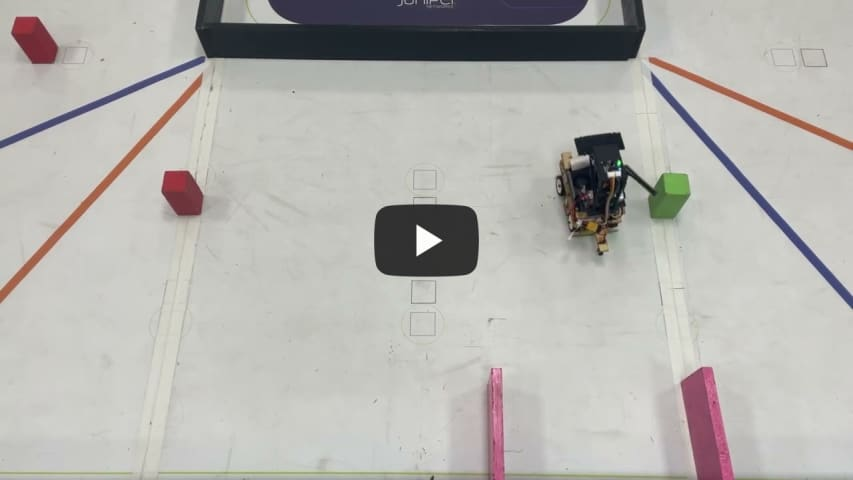</a></td>
</tr>
</table>
</div>

## <div align="center">Counter-clockwise red departure process</div>
<div align=center>
<table>
<tr>
<th width="50%">Step-1: Preparing to turn left</th>
<th width="50%">Step-2: Start_reversing</th>
</tr><tr align=center>
<td width="50%"></td>
<td width="50%"></td>
</tr>

<tr>
<th width="50%">Step-3: Prepare to back up and turn left</th>
<th width="50%">Step-4: Arrive at the designated location</th>
</tr><tr align=center>
<td width="50%"></td>
<td width="50%"></td>
</tr>

<tr>
<th colspan=2>Video Documentation of the Autonomous Vehicle's Actual Run</th>
</tr>
<tr align=center>
<td colspan=2><a href="https://youtu.be/3sPefphX0xI" >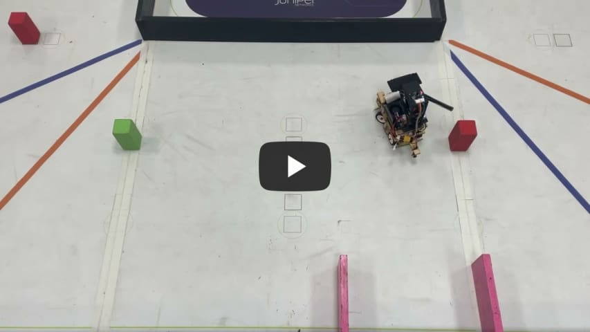</a></td>
</tr>
</table>
</div>

## <div align="center">Counter-clockwise, no color starting process</div>
<div align=center>
<table>
<tr>
<th width="50%">Step-1: Preparing to turn left</th>
<th width="50%">Step-2: Start_reversing</th>
</tr><tr align=center>
<td width="50%"></td>
<td width="50%"></td>
</tr>

<tr>
<th width="50%">Step-3: Prepare to back up and turn left</th>
<th width="50%">Step-4: Arrive at the designated location</th>
</tr><tr align=center>
<td width="50%"></td>
<td width="50%"></td>
</tr>

<tr>
<th colspan=2>Video Documentation of the Autonomous Vehicle's Actual Run</th>
</tr><tr align=center>
<td colspan=2><a href="https://youtu.be/kS-VRQUwHtw" ></a></td>
</tr>
</table>
</div>

## <div align="center">Clockwise Green Departure Process</div>
<div align=center>
<table>
<tr>
<th width="50%">Step-1: Preparing to turn right</th>
<th width="50%">Step-2: Ready to move forward</th>
</tr><tr align=center>
<td width="50%"></td>
<td width="50%"></td>
</tr>

<tr>
<th width="50%">Step-3: Preparing to turn left</th>
<th width="50%">Step-4: Ready to move forward</th>
</tr><tr align=center>
<td width="50%"></td>
<td width="50%"></td>
</tr>

<tr>
<th width=50%>Step-5: Arrive at the designated location</th>
<th width=50%>Video Documentation of the Autonomous Vehicle's Actual Run</th>
</tr><tr align=center>
<td width=50%>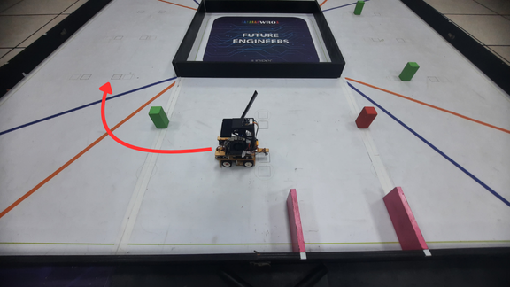</td>
<td width=50%><a href="https://youtu.be/RobF20wQFs8">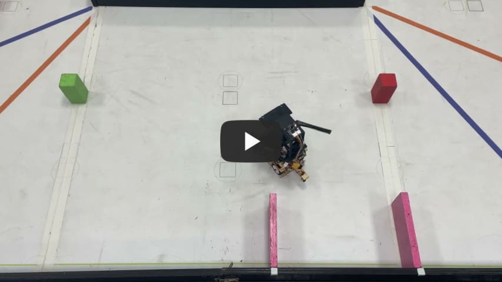</a></td>
</tr>
</table>
</div>

## <div align="center">Clockwise Red Departure Process</div>
<div align=center>
<table>
<tr>
<th width="50%">Step-1: Preparing to turn right</th>
<th width="50%">Step-2: Ready to move forward</th>
</tr><tr align=center>
<td width="50%"></td>
<td width="50%"></td>
</tr>

<tr>
<th width="50%">Step-3: Preparing to turn left</th>
<th width="50%">Step-4: Ready to move forward</th>
</tr><tr align=center>
<td width="50%"></td>
<td width="50%">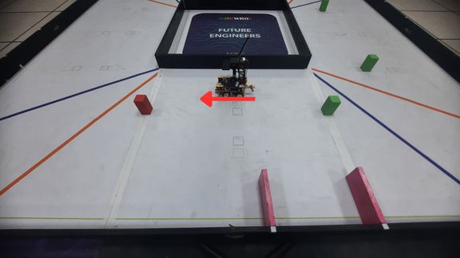</td>
</tr>

<tr>
<th>Step-5: Arrive at the designated location</th>
<th>Video Documentation of the Autonomous Vehicle's Actual Run</th>
</tr><tr align=center>
<td width="50%">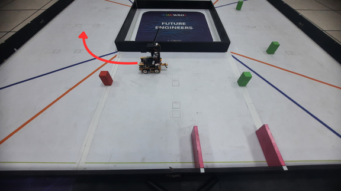</td>
<td width="50%"><a href="https://youtu.be/_NSuhBujNAg">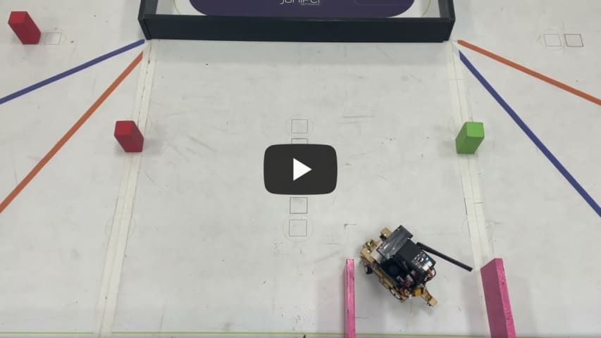</a></td>
</tr>
</table>
</div>

## <div align="center">Clockwise green center departure process</div>
<div align=center>
<table>
<tr>
<th width="50%">Step-1: Preparing to turn right</th>
<th width="50%">Step-2: Preparing to turn left</th>
</tr><tr align=center>
<td width="50%">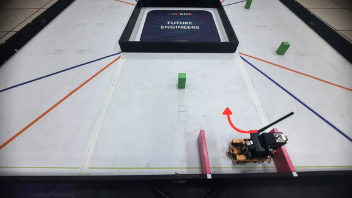</td>
<td width="50%">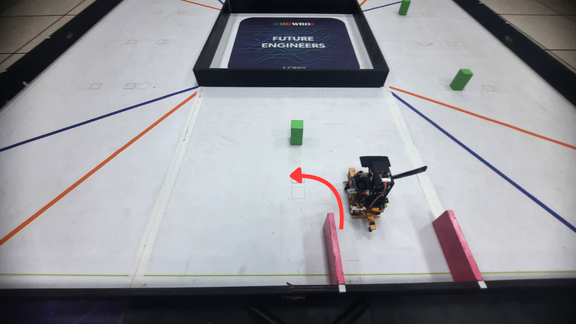</td>
</tr>

<tr>
<th width="50%">Step-3: Ready to move forward</th>
<th width="50%">Step-4: Arrive at the designated location</th>
</tr>
<tr>
<td width="50%">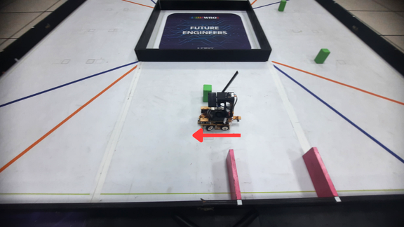</td>
<td width="50%">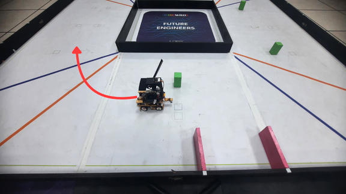</td>
</tr>

<tr>
<th colspan=2>Video Documentation of the Autonomous Vehicle's Actual Run</th>
</tr>
<tr align=center>
<td colspan=2><a href="https://youtu.be/J43t55lzJF8" >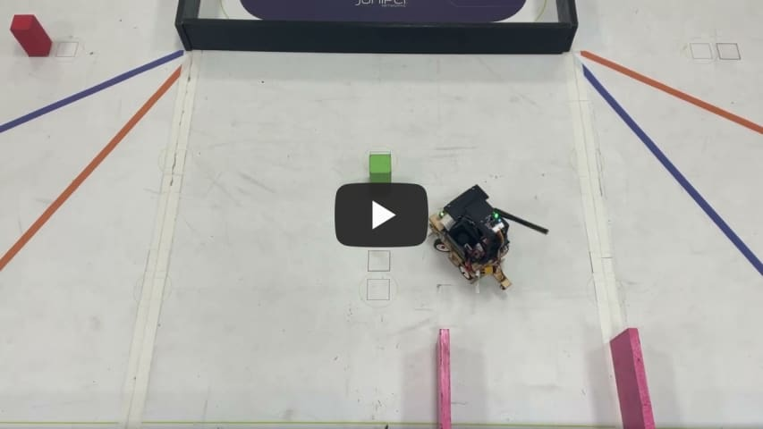</a></td>
</tr>
</table>
</div>

## <div align="center">Clockwise red center departure process</div>
<div align=center>
<table>
<tr>
<th width="50%">Step-1: Preparing to turn right</th>
<th width="50%">Step-2: Ready to move forward</th>
</tr><tr>
<td width="50%"></td>
<td width="50%"></td>
</tr

<tr>
<th width="50%">Step-3: Preparing to turn left</th>
<th width="50%">Step-4: Ready to move forward</th>
</tr><tr>
<td width="50%">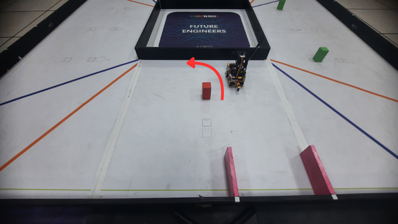</td>
<td width="50%"></td>
</tr>

<tr>
<th>Step-5: Arrive at the designated location</th>
<th>Video Documentation of the Autonomous Vehicle's Actual Run</th>
</tr>
<tr align=center>
<td>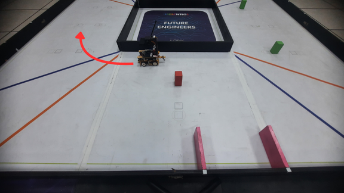</td>
<td><a href="https://youtu.be/4ebtIaPdVeI" >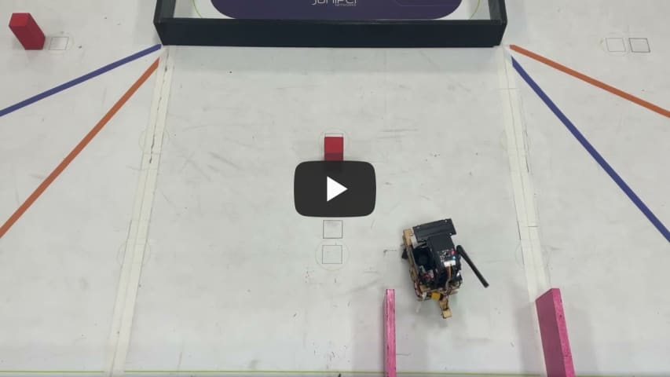</a></td>
</tr>

</table>
</div>

# <div align="center">[Return Home](../../)</div>  
