<div align="center"></div>

## <div align="center">Vehicle Parking Procedure Guide</div>
###  **Code Logic Description: Parking Task After Three Laps**
- ### Parking program
    
    1.  **Parking Zone Identification and Entry Preparation (Jetson Orin Nano)**
      * While the vehicle is driving, the **Jetson Orin Nano system** continuously identifies the **precise location of the parking lot** by detecting the **magenta square** via the camera.
      * When the vehicle **completes the third lap**, the autonomous car executes a **turn to enter the parking zone** and continues to **drive forward** until the **infrared sensor detects a wall**. At this point, the vehicle immediately performs a **reverse turn** and adjusts its body orientation towards the parking lot's precise direction.

    2.  **Precise Positioning and Bay Entry Start (Jetson Orin Nano)**
      * Once the vehicle is oriented towards the parking area, the **Jetson Orin Nano** **measures the lateral distance** between the vehicle and the **magenta parking bay marker** in real-time via the camera, ensuring an appropriate entry gap is maintained.
      * To confirm the vehicle has reached the **precise entry starting position**, the program continuously monitors the **area of the magenta marker** captured by the camera.
      * Once the **area of the magenta region is less than 100**, the positioning is confirmed. The vehicle then continues to **follow the wall line for 100 degrees** , followed by executing the **turning action to enter the parking bay**.

    3.  **Parallel Reverse Parking and Attitude Control (Raspberry Pi Pico W)**
      * After confirming the target parking direction, the system executes a maneuver that **simulates real-world parallel parking**.
      * First, the **Jetson Orin Nano** calculates and sets the **initial angle of the steering servo motor** and the **value for the DC drive motor**.
      * During the reverse parking maneuver, the **main control unit (Raspberry Pi Pico W)** is responsible for **reading the gyroscope angle data** from the Jetson Orin Nano (or directly implementing attitude control), which allows for **precise control over the vehicle's posture and steering angle**. The Pico W simultaneously adjusts the servo motor, thereby **completing the automatic parallel reverse parking action**.    

- **Code Executed on the Raspberry Pi Pico W Controller**
    ``` python
    while mode == 3:
        json_obj, _, got_stop = pump_uart(s) # Pump UART for data
        extract_magenta_from_json(json_obj) # Update magenta data
        while abs(yaw) < 85: # Loop while yaw is less than 85 degrees
            json_obj, _, got_stop = pump_uart(s) # Pump UART for data
            if json_obj:
                if "yaw" in json_obj:
                    try:
                        yaw = float(json_obj["yaw"]) # Update yaw
                    except:
                        pass
                extract_magenta_from_json(json_obj) # Update magenta data
            if turn == 2: # Turn 2 (e.g., Left start)
                set_servo_angle(45) # Set servo angle
                control_motor(35) # Set motor speed
            else: # Turn 1 (e.g., Right start)
                set_servo_angle(-40) # Set servo angle
                control_motor(35) # Set motor speed                 
        motor_brake() # Stop motor
        set_servo_angle(0) # Center servo
        mode = 4 # Change mode
                
            
    while mode == 4:
        a0_value = A0.read_u16() # Read ADC A0 value
        time_a0=time.time() # Record start time
        while a0_value > 64800 and time.time()- time_a0 < 5: # Loop while A0 value is high and time limit not reached
            a0_value = A0.read_u16() # Read ADC A0 value
            extract_magenta_from_json(json_obj) # Update magenta data 
            json_obj, _, got_stop = pump_uart(s) # Pump UART for data
            if json_obj:
                if "yaw" in json_obj:
                    try:
                        yaw = float(json_obj["yaw"]) # Update yaw
                    except:
                        pass
                extract_magenta_from_json(json_obj) # Update magenta data  
            set_servo_angle(0) # Center servo
            control_motor(30) # Drive motor forward
        control_motor(-40) # Drive motor backward
        time.sleep(0.1) # Wait for a short time
        control_motor(0) # Stop motor
        mode = 5 # Change mode

    while mode == 5:
        json_obj, _, got_stop = pump_uart(s) # Pump UART for data
        while abs(yaw) < 177: # Loop while yaw is less than 177 degrees
            extract_magenta_from_json(json_obj) # Update magenta data
            json_obj, _, got_stop = pump_uart(s) # Pump UART for data
            if json_obj:
                if "yaw" in json_obj:
                    try:
                        yaw = float(json_obj["yaw"]) # Update yaw
                    except:
                        pass
            if turn == 2: # Turn 2
                set_servo_angle(-180) # Set servo angle
                control_motor(-40) # Drive motor backward
            else: # Turn 1
                set_servo_angle(180) # Set servo angle
                control_motor(-40) # Drive motor backward                  
        motor_brake() # Stop motor
        set_servo_angle(0) # Center servo
        mode = 6 # Change mode
                
    while mode == 6:
        json_obj, m_tuple, got_stop = pump_uart(s) # Pump UART for data
        extract_magenta_from_json(json_obj) # Update magenta data
        while magArea > 70: # Loop while magenta area is greater than 70
            extract_magenta_from_json(json_obj) # Update magenta data
            json_obj, m_tuple, got_stop = pump_uart(s) # Pump UART for data
            if json_obj:
                try:
                    if "leftArea" in json_obj:
                        leftArea = int(json_obj.get("leftArea", leftArea)) # Update left area
                    if "rightArea" in json_obj:
                        rightArea = int(json_obj.get("rightArea", rightArea)) # Update right area
                        except:
                            pass
            if turn ==2: # Turn 2
                if magArea > 3000:
                    error = magCX - 202 # Calculate error based on CX
                    Servo_angle = int(error*0.15 + (error - error1)*0.2) # PD control
                    error1 = error # Update previous error
                    set_servo_angle(Servo_angle) # Set servo angle
                    control_motor(40) # Drive motor forward
                else:
                    error = leftArea - 6500 # Calculate error based on left area
                    Servo_angle = int(error*0.005 + (error - error1)*0.01) # PD control
                    error1 = error # Update previous error
                    set_servo_angle(Servo_angle) # Set servo angle
                    control_motor(40) # Drive motor forward
            else: # Turn 1
                if magArea > 3000:
                    error = magCX - 490 # Calculate error based on CX
                    Servo_angle = int(error*0.13 + (error - error1)*0.2) # PD control
                    error1 = error # Update previous error
                    set_servo_angle(Servo_angle) # Set servo angle
                    control_motor(40) # Drive motor forward
                else:
                    error = 7000 - rightArea # Calculate error based on right area
                    Servo_angle = int(error*0.005 + (error - error1)*0.008) # PD control
                    error1 = error # Update previous error
                    set_servo_angle(Servo_angle) # Set servo angle
                    control_motor(40) # Drive motor forward
        control_motor(-50) # Drive motor backward
        time.sleep(0.1) # Wait for a short time
        control_motor(0) # Stop motor
        time.sleep(0.5) # Wait for a short time
        mode = 7 # Change mode

    while mode == 7:
        json_obj, _, got_stop = pump_uart(s) # Pump UART for data
        while abs(yaw) > 110: # Loop while yaw is greater than 110 degrees
            json_obj, _, got_stop = pump_uart(s) # Pump UART for data
            if json_obj:
                if "yaw" in json_obj:
                    try:
                        yaw = float(json_obj["yaw"]) # Update yaw
                    except:
                        pass
            if turn == 2: # Turn 2  
                set_servo_angle(-180) # Set servo angle
                control_motor(-38) # Drive motor backward
            else: # Turn 1
                set_servo_angle(180) # Set servo angle
                control_motor(-38) # Drive motor backward
        control_motor(50) # Drive motor backward
        time.sleep(0.1) # Wait for a short time
        control_motor(0) # Stop motor
        mode =8 # Change mode 
    while mode == 8:
        json_obj, _, got_stop = pump_uart(s) # Pump UART for data
        a1_value = A1.read_u16() # Read ADC A1 value
        while abs(yaw) < 140 and a1_value > 64800: # Loop while yaw < 140 and A1 is high
            a1_value = A1.read_u16() # Read ADC A1 value
            json_obj, _, got_stop = pump_uart(s) # Pump UART for data
            if json_obj:
                if "yaw" in json_obj:
                    try:
                        yaw = float(json_obj["yaw"]) # Update yaw
                    except:
                        pass
            if turn == 2: # Turn 2  
                set_servo_angle(180) # Set servo angle
                control_motor(-35) # Drive motor backward
            else: # Turn 1
                set_servo_angle(-180) # Set servo angle
                control_motor(-35) # Drive motor backward  
        control_motor(40) # Drive motor forward
        time.sleep(0.1) # Wait for a short time
        control_motor(0) # Stop motor
        set_servo_angle(0) # Center servo
        mode =9 # Change mode
    while mode == 9:
        json_obj, _, got_stop = pump_uart(s) # Pump UART for data
        a0_value = A0.read_u16() # Read ADC A0 value
        while abs(yaw) < 160 : # Loop while yaw is less than 160 degrees
            a0_value = A0.read_u16() # Read ADC A0 value
            json_obj, _, got_stop = pump_uart(s) # Pump UART for data
            if json_obj:
                if "yaw" in json_obj:
                    try:
                        yaw = float(json_obj["yaw"]) # Update yaw
                    except:
                        pass
            if turn == 2: # Turn 2  
                set_servo_angle(-180) # Set servo angle
                control_motor(35) # Drive motor forward
            else: # Turn 1
                set_servo_angle(180) # Set servo angle
                control_motor(35) # Drive motor forward  
        control_motor(-40) # Drive motor backward
        time.sleep(0.1) # Wait for a short time
        control_motor(0) # Stop motor
        set_servo_angle(0) # Center servo
        mode =10 # Change mode 
    while mode == 10:
        json_obj, _, got_stop = pump_uart(s) # Pump UART for data
        a0_value = A0.read_u16() # Read ADC A0 value
        while abs(yaw) < 177 : # Loop while yaw is less than 177 degrees
            a0_value = A0.read_u16() # Read ADC A0 value
            json_obj, _, got_stop = pump_uart(s) # Pump UART for data
            if json_obj:
                if "yaw" in json_obj:
                    try:
                        yaw = float(json_obj["yaw"]) # Update yaw
                    except:
                        pass
            if turn == 2: # Turn 2  
                set_servo_angle(180) # Set servo angle
                control_motor(-35) # Drive motor backward
            else: # Turn 1
                set_servo_angle(-180) # Set servo angle
                control_motor(-35) # Drive motor backward  
        control_motor(40) # Drive motor backward
        time.sleep(0.1) # Wait for a short time
        control_motor(0) # Stop motor
        set_servo_angle(0) # Center servo
        mode =11 # Change mode
    while mode == 11:
        motor_brake() # Apply motor brake
    ```
## <div align="center">Counter-Clockwise Vehicle Parking Procedure </div>
<div align=center>
<table>
<tr>
<th width="50%">The vehicle proceeds forward through the parking area. </th>
<th width="50%"> The vehicle turns to the right, with its front facing the outer wall at a 90-degree azimuth.</th>
</tr>
<tr align=center>
<td width="50%">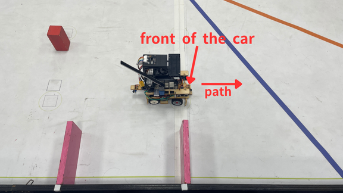 </td>
<td width="50%">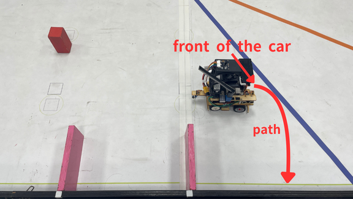</td>

</tr>
<tr>
<th width="50%">The vehicle drives straight toward the 90-degree azimuth until the infrared sensor detects the outer wall, then brakes.</th>
<th width="50%">The vehicle reverses towards the left-rear until its yaw angle exceeds 177 degrees.</th>
</tr>
<tr align=center>
<td width="50%">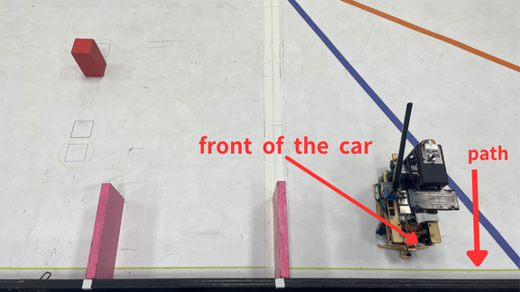</td>
<td width="50%">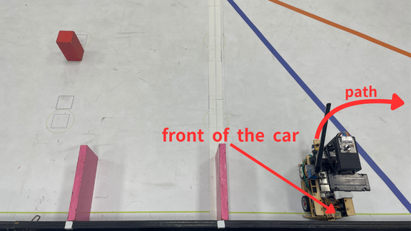</td>
</tr>

<tr>
<th width="50%"> The vehicle follows the outer wall until the area of the magenta wall contour is less than 100, then the vehicle moves forward another 100 degrees.</th>
<th width="50%">The vehicle reverses towards the rear-left into the parking area until its heading angle reaches 123 degrees.</th>
</tr>
<tr align=center>
<td width="50%">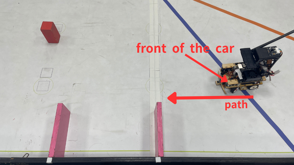 </td>
<td width="50%">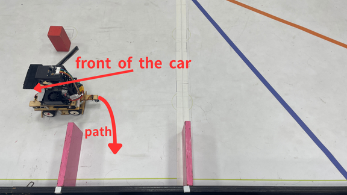 </td>
</tr>

<tr>
<th width="50%">The vehicle reverses towards the rear-right into the parking area until its heading angle reaches 177 degrees.</th>
<th width="50%">Vehicle Parking Finished </th>
</tr>
<tr align=center>
<td width="50%">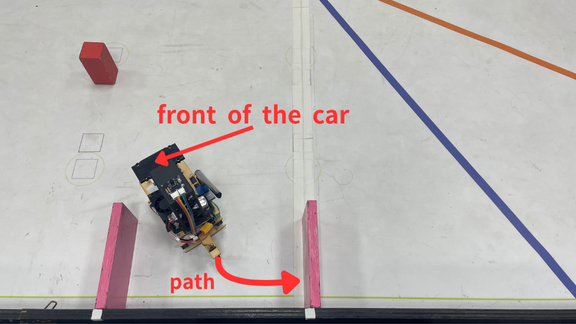 </td>
<td width="50%">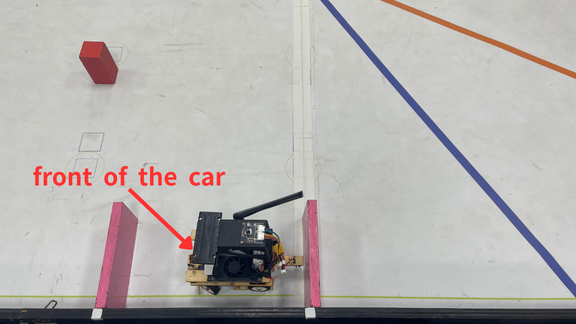 </td>
</tr>

<tr>
<th colspan = 2>Video Documentation of the Autonomous Vehicle's Actual Run</th>
</tr>
<tr align=center>
<td colspan = 2><a href="https://youtu.be/ZJdazgHVCGY" >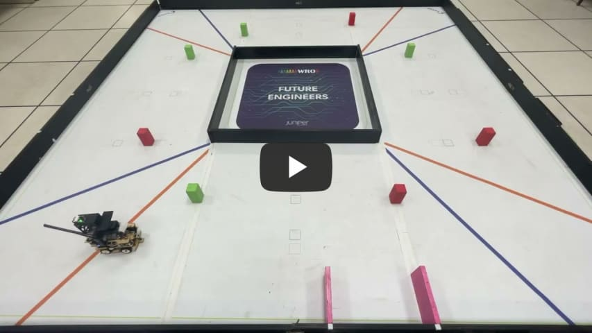</a></td>
</tr>
</table>
</div>

## <div align="center">Clockwise Vehicle Parking Procedure </div>
<div align=center>
<table>
<tr>
<th width="50%"> The vehicle proceeds forward through the parking area.</th>
<th width="50%"> The vehicle turns to the left, with its front facing the outer wall at a 90-degree azimuth.</th>
</tr>
<tr align=center>
<td width="50%"> 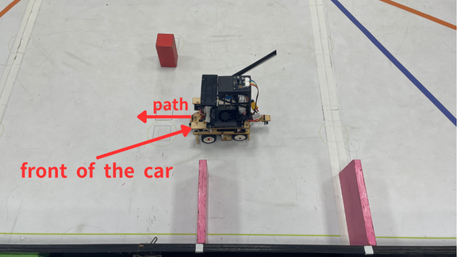</td>
<td width="50%"> 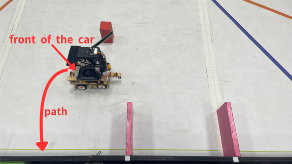</td>
</tr>

<tr>
<th width="50%">The vehicle drives straight toward the 90-degree azimuth until the infrared sensor detects the outer wall, then brakes. </th>
<th width="50%">The vehicle reverses towards the right-rear until its yaw angle exceeds 177 degrees. </th>
</tr>
<tr align=center>
<td width="50%">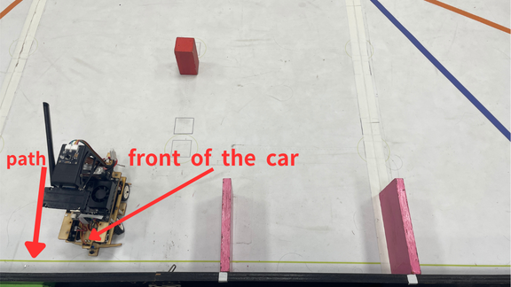 </td>
<td width="50%">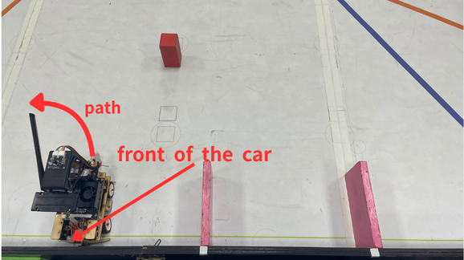 </td>
</tr>

<tr>
<th width="50%"> The vehicle follows the outer wall until the area of the magenta wall contour is less than 100, then the vehicle moves forward another 100 degrees.</th>
<th width="50%">The vehicle reverses towards the rear-right into the parking area until its heading angle reaches 123 degrees. </th>
</tr>
<tr align=center>
<td width="50%">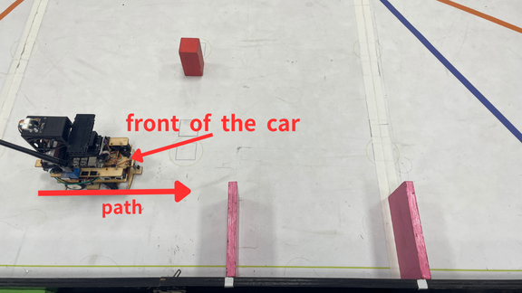</td>
<td width="50%"> </td>
</tr>

<tr>
<th width="50%">The vehicle reverses towards the rear-left into the parking area until its heading angle reaches 177 degrees. </th>
<th width="50%">Vehicle Parking Finished </th>
</tr>
<tr align=center>
<td width="50%">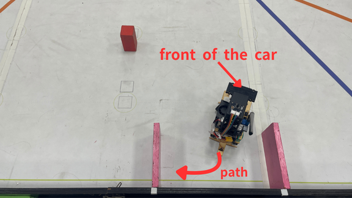 </td>
<td width="50%">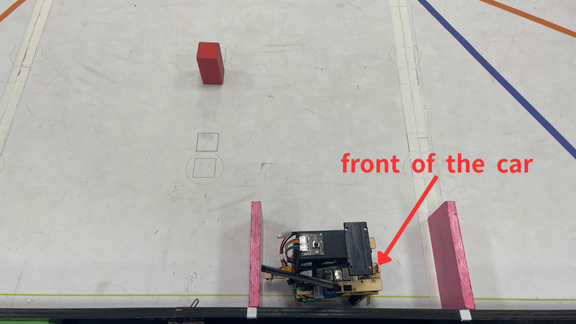 </td>
</tr>

<tr>
<th colspan = 2>Video Documentation of the Autonomous Vehicle's Actual Run</th>
</tr>
<tr align=center>
<td colspan = 2><a href="https://youtu.be/eZsEFtIm0SM" >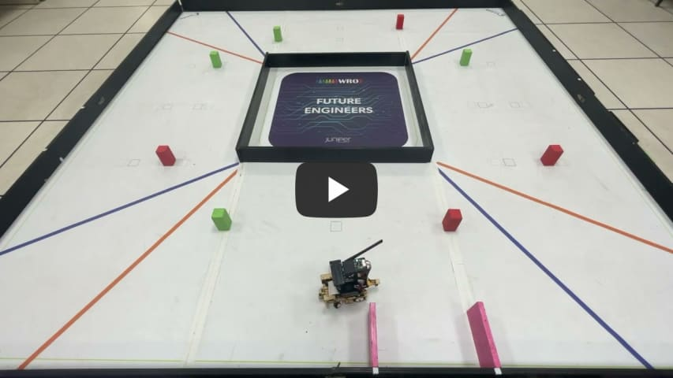</a></td>
</tr>
</table>
</div>
  

# <div align="center">[Return Home](../../)</div>  
