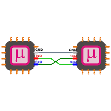

## 
Web Sockets Introduction

- Web Sockets 是一種在單一 TCP 連線上實現全雙工(Full-duplex)通訊的網路協定，讓伺服器與用戶端能夠在建立連線後持續交換資料，而不需要像傳統HTTP那樣每次都重新建立連線。這項技術特別適合即時性應用，例如線上聊天、即時遊戲、即時股價更新、物聯網資料傳輸等。

- 當用戶端透過HTTP發出WebSockets請求並與伺服器完成握手之後，雙方之間就能自由地互傳訊息。與輪詢(Polling)或常連線(Long Pollling)相比，WebSockets的資料傳輸延遲更低、效能更高，也能顯著減少伺服器的負擔。

- 在程式設計上，開發者可以透過Javascript的WebSocket物件用於瀏覽器端建立連線，伺服器端則常用Python(如WebSockets、FastAPI)、Node.js、Go等框架支援。

- 而在此次比賽中我們就使用的Web Sockets這種通訊協定，使Jetson Orin Nano和Raspberry Pi Pico W可以進行資訊交換，像是傳送底盤控制參數，感測器數值交換等。以下是三種傳輸協定的特性比較。

    <table width=1200>
        <tr>
            <th colspan=4>WebSockets vs HTTP vs UART 比較</th>
        </tr>
        <tr>
            <th rowspan=2 width=20%>特性</th>
            <th width=25%>

</th>
            <th width=25%>

</th>
            <th width=25%>

</th>
        </tr>
        <tr>
            <th>HTTP</th>
            <th>WebSockets</th>
            <th>UART</th>
        </tr>
        <tr>
            <th>通訊型態</th>
            <td>請求 - 回應(半雙工)</td>
            <td>持續連線(全雙工)</td>
            <td>點對點(全雙工)</td>
        </tr>
        <tr>
            <th>建立連線</th>
            <td>每次請求都重新建立</td>
            <td>只需一次握手，保持連線</td>
            <td>物理層面直接連線</td>
        </tr>
        <tr>
            <th>即時性</th>
            <td>低(需重複請求)</td>
            <td>高(伺服器可主動推送)</td>
            <td>高(即時傳輸)</td>
        </tr>
        <tr>
            <th>傳輸媒介</th>
            <td>網路(TCP/HTTP)</td>
            <td>網路(TCP/WebSocket協定)</td>
            <td>實體線路（UART TX/RX）</td>
        </tr>
        <tr>
            <th>適用場景</th>
            <td>網頁瀏覽、API 請求</td>
            <td>即時聊天、線上遊戲、IoT</td>
            <td>裝置間資料傳輸</td>
        </tr>
        <tr>
            <th>延遲</th>
            <td>高</td>
            <td>低</td>
            <td>低</td>
        </tr>
    </table>

### WebSockets 的優勢重點
 - 即時雙向通訊
   - 一旦握手成功，伺服器與用戶端可隨時互相發送資料，不必等待請求。
   - 適合需要即時通訊的專案。
 - 降低網路負荷
   - 不需要一直重新請求HTTP連線可以降低Jetson Orin Nano的負荷。
 - 低延遲
   - 傳輸延遲僅為數毫秒，幾乎跟UART的速度馳平。
 - 基於網路層面傳輸
   - 透過網路傳輸不需要實體傳輸線可以避免傳輸線損壞而無法運作。
 - 總結
   - WebSockets幾乎就是物聯網的UART協定，完全目前我們目前的需求，因此我們決定使用WebSockets代替UART傳輸。