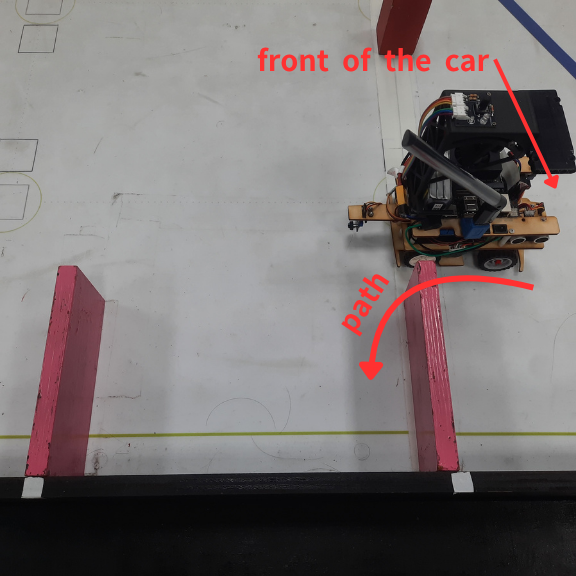
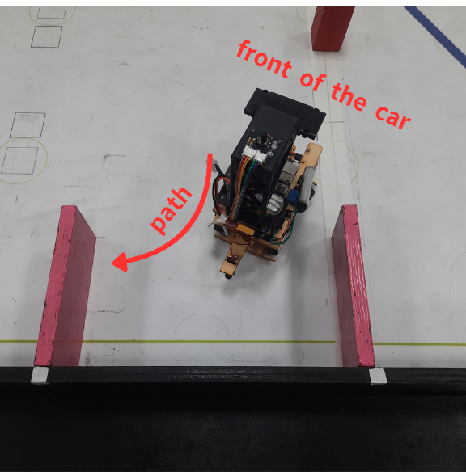
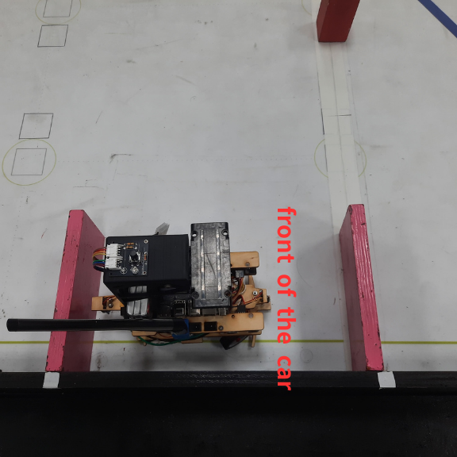

<div align="center"></div>

## <div align="center">Explanation of the parking method-停車方法說明</div>
  **Below is the code for performing the parking task after completing three laps.-以下是完成三圈後執行停車任務的程式碼。**
- ### Parking program-停車計劃
    ### 中文:
    - 當車輛行駛時，系統（Jetson Orin Nano）首先透過攝影機測洋紅色方塊來識別停車場的位置。當車輛到達第三圈的時候，先轉彎往前直到紅外線感測器側牆壁在後退轉彎並調整朝向停車場的方向。 
    - 車輛進入停車場區域後，系統 (Jetson Orin Nano) 透過攝影機即時測量車輛與洋紅色停車位之間的橫向距離，以確保保持適當的進場間距。為確認車輛已抵達精確的入庫起始位置，程式持續監測攝影機所擷取的洋紅色標誌面積。一旦洋紅色區域的面積小於 100達到定位，車輛繼續沿牆邊線循跡100度，隨後執行轉入停車位的動作
    - 在確認目標停車方向後，系統將執行模擬真實世界的平行停車。首先，計算並設定轉向伺服馬達的起始角度，以及驅動馬達。在倒車入庫過程中，主控單元 (Raspberry Pi Pico W) 讀取來自 Jetson Orin Nano 的陀螺儀角度數據，以精確控制車輛的姿態與轉向角度，並同步調整伺服馬達，從而完成自動平行倒車入庫動作。
    ### 英文:
    - When the vehicle is in motion, the system (Jetson Orin Nano) first uses the camera to detect the pink square to identify the location of the parking lot. When the vehicle reaches the last turn of the third lap, it first proceeds to the end zone and pauses momentarily. The vehicle then completes another lap and, upon approaching the turn near the parking lot, reduces its speed to park precisely in the designated spot. At this point, the system uses the highlighted values from the camera to assess the distance between the vehicle and the front boundary wall, adjusting its direction toward the parking lot.

    - Upon entering the parking lot, the system (Jetson Orin Nano) employs the camera’s side-highlight detection area to measure the distance between the vehicle and the side wall, ensuring the vehicle maintains an appropriate distance from the pink square marking the parking space. To confirm the vehicle’s arrival at the designated parking position, the system (Raspberry Pi Pico) utilizes ultrasonic sensors on both sides to detect the boundaries of the parking area as the vehicle advances. Once the vehicle detects the walls, it compares the left and right ultrasonic values: if the left value is greater than the right, it parks to the right; otherwise, it parks to the left.

    - After confirming the parking direction, the system applies a real-world parallel parking approach. First, it sets the steering angle for the servo motor and the angle needed for the motor to reach the target position. During the parking process, the system (Raspberry Pi Pico) controls the motor to achieve the target angle while simultaneously adjusting the servo motor, thereby completing the reverse parking maneuver.
    

  - **Code running on the Raspberry Pi Pico W controller.-在 Raspberry Pi Pico W 控制器上執行的程式碼。**
        ``` 
        while mode == 3:
            json_obj, _, got_stop = pump_ws(s)
            extract_magenta_from_json(json_obj)
            while abs(yaw) < 73:
                json_obj, _, got_stop = pump_ws(s)
                if json_obj:
                    if "yaw" in json_obj:
                        try:
                            yaw = float(json_obj["yaw"])
                            except:
                                pass
                        extract_magenta_from_json(json_obj)
                    if turn == 2:    
                        set_servo_angle(50)
                        control_motor(35)
                    else:
                        set_servo_angle(-50)
                        control_motor(35)                        
                motor_brake()
                set_servo_angle(0)
                mode = 4

        while mode == 4:
            a0_value = A0.read_u16()
            time_a0=time.time()
            set_servo_angle(0)
            while a0_value > 64500 and time.time()- time_a0 < 6:
                a0_value = A0.read_u16()
                extract_magenta_from_json(json_obj) 
                json_obj, _, got_stop = pump_ws(s)
                if json_obj:
                    if "yaw" in json_obj:
                        try:
                            yaw = float(json_obj["yaw"])
                            except:
                                pass
                        extract_magenta_from_json(json_obj)  
                set_servo_angle(0)
                control_motor(30)
            control_motor(-40)
            time.sleep(0.15)
            control_motor(0)
            run_encoder_Auto(100, -35, 0)
            mode = 5

        while mode == 5:
            json_obj, _, got_stop = pump_ws(s)
            while abs(yaw) < 177:
                extract_magenta_from_json(json_obj)
                json_obj, _, got_stop = pump_ws(s)
                if json_obj:
                    if "yaw" in json_obj:
                        try:
                            yaw = float(json_obj["yaw"])
                            except:
                                pass
                if turn == 2:
                    set_servo_angle(-180)
                    control_motor(-35)
                else:
                    set_servo_angle(180)
                    control_motor(-35)                        
            motor_brake()
            set_servo_angle(0)
            mode = 6
        
        while mode == 6:
            control_motor(38)
            json_obj, m_tuple, got_stop = pump_ws(s)
            extract_magenta_from_json(json_obj)
            while magArea > 100:
                extract_magenta_from_json(json_obj)
                json_obj, m_tuple, got_stop = pump_ws(s)
                if json_obj:
                    try:
                        if "leftArea" in json_obj:
                            leftArea = int(json_obj.get("leftArea", leftArea))
                        if "rightArea" in json_obj:
                            rightArea = int(json_obj.get("rightArea", rightArea))
                        except:
                            pass
                if turn ==2:
                    if magArea > 3000:
                        error = magCX - 150 
                        Servo_angle = int(error*0.15 + (error - error1)*0.2)
                        error1 = error
                        set_servo_angle(Servo_angle)
                    else:
                        error = leftArea - 6500
                        Servo_angle = int(error*0.003 + (error - error1)*0.008)
                        error1 = error
                        set_servo_angle(Servo_angle)
                else:
                    if magArea > 3000:
                        error = magCX - 470
                        Servo_angle = int(error*0.13 + (error - error1)*0.2)
                        error1 = error
                        set_servo_angle(Servo_angle)
                    else:
                        error = 8000 - rightArea 
                        Servo_angle = int(error*0.003 + (error - error1)*0.008)
                        error1 = error
                        set_servo_angle(Servo_angle)
            control_motor(-30)
            time.sleep(0.1)
            control_motor(0)
            mode = 7
        while mode == 7:
            encoder_count = 0
            control_motor(38)
            json_obj, m_tuple, got_stop = pump_ws(s)
            extract_magenta_from_json(json_obj)
            while abs(encoder_count) < 100:
                extract_magenta_from_json(json_obj)
                json_obj, m_tuple, got_stop = pump_ws(s)
                if json_obj:
                    try:
                        if "leftArea" in json_obj:
                            leftArea = int(json_obj.get("leftArea", leftArea))
                        if "rightArea" in json_obj:
                            rightArea = int(json_obj.get("rightArea", rightArea))
                        except:
                            pass
                if turn == 2:
                    error = leftArea - 6500
                    Servo_angle = int(error*0.005 + (error - error1)*0.008)
                    error1 = error
                    set_servo_angle(Servo_angle)
                else:
                    error = 3500 - rightArea
                    Servo_angle = int(error*0.005 + (error - error1)*0.01)
                    error1 = error
                    set_servo_angle(Servo_angle)
            mode = 8
        while mode == 8:
            json_obj, _, got_stop = pump_ws(s)
            while abs(yaw) > 123:
                json_obj, _, got_stop = pump_ws(s)
                if json_obj:
                    if "yaw" in json_obj:
                        try:
                            yaw = float(json_obj["yaw"])
                            except:
                                pass
                if turn == 2:     
                    set_servo_angle(-180)
                    control_motor(-37)
                else:
                    set_servo_angle(180)
                    control_motor(-37)
            motor_brake()
            set_servo_angle(0)
            mode =9 
        while mode == 9:
            json_obj, _, got_stop = pump_ws(s)
            a1_value = A1.read_u16()
            while abs(yaw) < 177 and a1_value > 64000:
                a0_value = A0.read_u16()
                json_obj, _, got_stop = pump_ws(s)
                if json_obj:
                    if "yaw" in json_obj:
                        try:
                            yaw = float(json_obj["yaw"])
                            except:
                                pass
                if turn == 2:     
                    set_servo_angle(180)
                    control_motor(-35)
                else:
                    set_servo_angle(-180)
                    control_motor(-35)   
            control_motor(40)
            time.sleep(0.15)
            control_motor(0)
            set_servo_angle(0)
            mode =10 
        while mode == 10:
            motor_brake()
        
        ```
## <div align="center">Counter-clockwise parking procedure-逆時針停車流程</div>
<div align=center>

  |Start reversing to the left(開始向左反轉)|Then turn right(然後向右正轉)|Parking ended(停車結束)|
  |:---:|:---:|:---:|
  |<div align="center"> </div>|<div align="center"> </div>|<div align="center"> </div>|
## <div align="center">Clockwise parking procedure-順時針停車流程</div>
<div align=center>

  |Start turning right clockwise(開始向右正轉)|Then reverse to the left(然後向左反轉)|Parking ended(停車結束)|
  |:---:|:---:|:---:|
  |<div align="center"> </div>|<div align="center"> </div>|<div align="center"> </div>|

- ### Parking test video-停車測試影片
( "Open Challange clockwise @ Fire On All Cylinders")

# <div align="center">[Return Home](../../)</div>  
