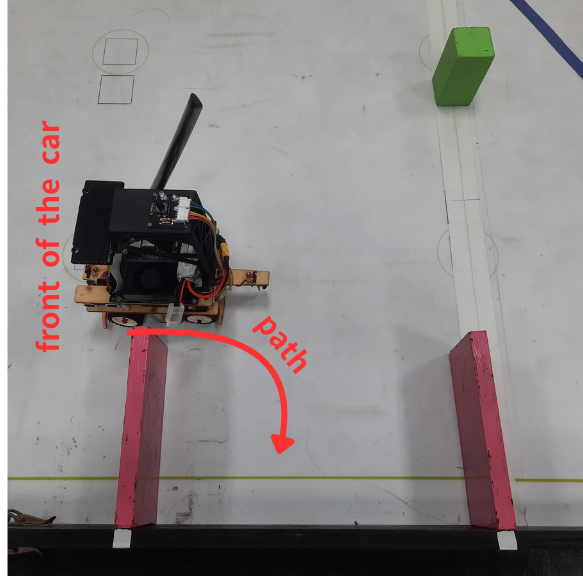
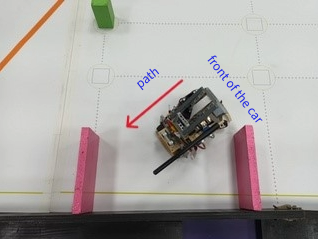
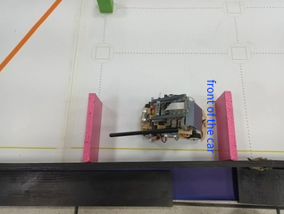
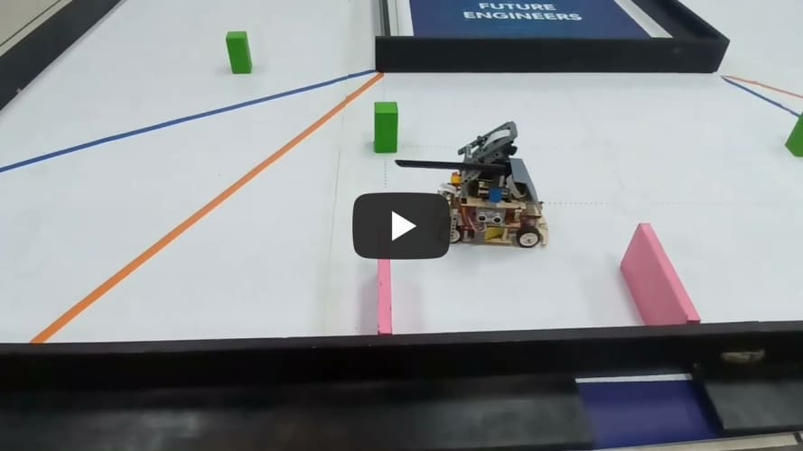

<div align="center"></div>

## <div align="center">Explanation of the parking method-停車方法說明</div>
  **Below is the code for performing the parking task after completing three laps.-以下是完成三圈後執行停車任務的程式碼。**
- ### Parking program-停車計劃
    ### 中文:
    - 當車輛行駛時，系統（Jetson Nano）首先透過攝影機偵測粉紅色方塊來識別停車場的位置。當車輛到達第三圈的最後一個彎道時，它首先駛向終點區並短暫停留。然後，車輛完成另一圈，並在接近停車場附近的轉彎處時降低速度，精確停在指定位置。此時，系統使用攝影機突出顯示的數值來評估車輛與前邊界牆之間的距離，並調整其朝向停車場的方向。 
    - 進入停車場後，系統（Jetson Nano）利用攝影機的側面高光偵測區域測量車輛與側壁之間的距離，確保車輛與標記停車位的粉紅色方塊保持適當的距離。為了確認車輛到達指定的停車位置，系統（Raspberry Pi Pico）利用兩側的超音波感測器在車輛前進時偵測停車區域的邊界。一旦車輛偵測到牆壁，就會比較左右兩側的超音波值：如果左側值大於右側值，則向右停車；否則，車輛將停在左側。 
    - 確認停車方向後，系統採用真實世界的平行停車方法。首先，它設定伺服馬達的轉向角度以及馬達到達目標位置所需的角度。在停車過程中，系統（Raspberry Pi Pico）控制馬達達到目標角度的同時，同步調整伺服電機，從而完成倒車停車動作。
    ### 英文:
    - When the vehicle is in motion, the system (Jetson Nano) first uses the camera to detect the pink square to identify the location of the parking lot. When the vehicle reaches the last turn of the third lap, it first proceeds to the end zone and pauses momentarily. The vehicle then completes another lap and, upon approaching the turn near the parking lot, reduces its speed to park precisely in the designated spot. At this point, the system uses the highlighted values from the camera to assess the distance between the vehicle and the front boundary wall, adjusting its direction toward the parking lot.

    - Upon entering the parking lot, the system (Jetson Nano) employs the camera’s side-highlight detection area to measure the distance between the vehicle and the side wall, ensuring the vehicle maintains an appropriate distance from the pink square marking the parking space. To confirm the vehicle’s arrival at the designated parking position, the system (Raspberry Pi Pico) utilizes ultrasonic sensors on both sides to detect the boundaries of the parking area as the vehicle advances. Once the vehicle detects the walls, it compares the left and right ultrasonic values: if the left value is greater than the right, it parks to the right; otherwise, it parks to the left.

    - After confirming the parking direction, the system applies a real-world parallel parking approach. First, it sets the steering angle for the servo motor and the angle needed for the motor to reach the target position. During the parking process, the system (Raspberry Pi Pico) controls the motor to achieve the target angle while simultaneously adjusting the servo motor, thereby completing the reverse parking maneuver.
    
  - **Code running on the Jetson Nano controller.-在 Jetson Nano 控制器上執行的程式碼**
    ```
        #parking area turn
        if turn_side == 4:
            if not ROI2:
                PWM = 25
                current_time = time.time()
                elapsed_time = current_time - start_time
                if elapsed_time != 0.8 and time_count > 0 or elapsed_time < 0.9:
                    if target_heading == left_heading or target_heading == red_left_heading:
                        if roi_values[0] > 6000:
                            combined_control_signal = -100
                        else:
                            combined_control_signal = 65
                    else:
                        if roi_values[1] > 5000:
                            combined_control_signal = 65
                        else:
                           combined_control_signal = -80
                    time_count = time_count-1
                    time.sleep(0.01)
                else:
                    if target_heading == left_heading or target_heading == red_left_heading:
                        combined_control_signal = pd_control(target_heading[count], heading, kp_heading, kd_heading)
                    else:
                        combined_control_signal = pd_control(target_heading[count], heading, kp_heading, kd_heading)
                if roi_values[2] >= 7500:
                    ROI2 = True
                    time_count = 0
            if ROI2:
                PWM = -35
                if target_heading == left_heading or target_heading == red_left_heading:
                        combined_control_signal = 180
                else:
                        combined_control_signal = -180
                if heading < target_heading[count+1] + 30 and heading > target_heading[count+1] - 30:
                    combined_control_signal = 0
                    turn_side = 5

        #parking area
        if turn_side == 5:
            PWM = 30
            if pink_positions[1] != 0:
                print("pink")
                if target_heading == left_heading or target_heading == red_left_heading: 
                    combined_control_signal = -pd_control(55, pink_green_x_diff, kp_X, kd_X)
                elif target_heading == right_heading or target_heading == red_right_heading:
                    combined_control_signal = pd_control(15, pink_red_x_diff, kp_X, kd_X)
            else:
                if target_heading == left_heading or target_heading == red_left_heading:
                    print("right")
                    combined_control_signal = pd_control(7500, roi_values[0], kp_roi, kd_roi)
                else:
                    print("left")
                    combined_control_signal = -pd_control(7500, roi_values[1], kp_roi, kd_roi)
    ```
  - **Code running on the Raspberry Pi Pico controller.-在 Raspberry Pi Pico 控制器上執行的程式碼。**
    ``` 
        control_motor(35)
        time.sleep(0.4)
        control_motor(0)
        distance2 = measure_distance(trig2, echo2)
        distance1 = measure_distance(trig1, echo1)
        if distance1 > distance2:  # Right-side parking
            approach_until(trig2, echo2, 15, '>')
            approach_until(trig2, echo2, 20, '<')
            approach_until(trig2, echo2, 15, '>')
        # Reverse parking.
            run_encoder_Auto(300, 10, 0)
            run_encoder_Auto(1500, -45, 175)
            run_encoder_Auto(30, -10, -190)
            run_encoder_Auto(1400, -25, -190)
            run_encoder_Auto(480, 30, 180)
            run_encoder_Auto(10, 10, 0)
        # (Continue with the rest of the reverse parking sequence)
        else:  # Left-side parking
            approach_until(trig1, echo1, 15, '>')
            approach_until(trig1, echo1, 20, '<')
            approach_until(trig1, echo1, 15, '>')
        # Reverse parking.
            run_encoder_Auto(400, 10, 0)
            run_encoder_Auto(1620, -45, -190)
            run_encoder_Auto(30, -10, 180)
            run_encoder_Auto(1330, -25, 180)
            run_encoder_Auto(470, 30, -180)
            run_encoder_Auto(10, 10, 0)
        # (Continue with the rest of the reverse parking sequence)
                    
        control_motor(-25)
        time.sleep(0.35)
        control_motor(0)
        button_out.low()
                    
                
    except KeyboardInterrupt:
        motor_in1.off()
        motor_in2.off()
        set_servo_angle(0)
        print("Program interruption")
        
    ```
<div align=center>

  |Prepare_to_reverse(準備反轉)|Start_reversing(開始倒車)|Parking_ends(停車處結束)|
  |:---:|:---:|:---:|
  |<div align="center"> </div>|<div align="center"> </div>|<div align="center"> </div>|

- ### Parking test video-停車測試影片
[]( "Open Challange clockwise @ Fire On All Cylinders")

# <div align="center">[Return Home](../../)</div>  
