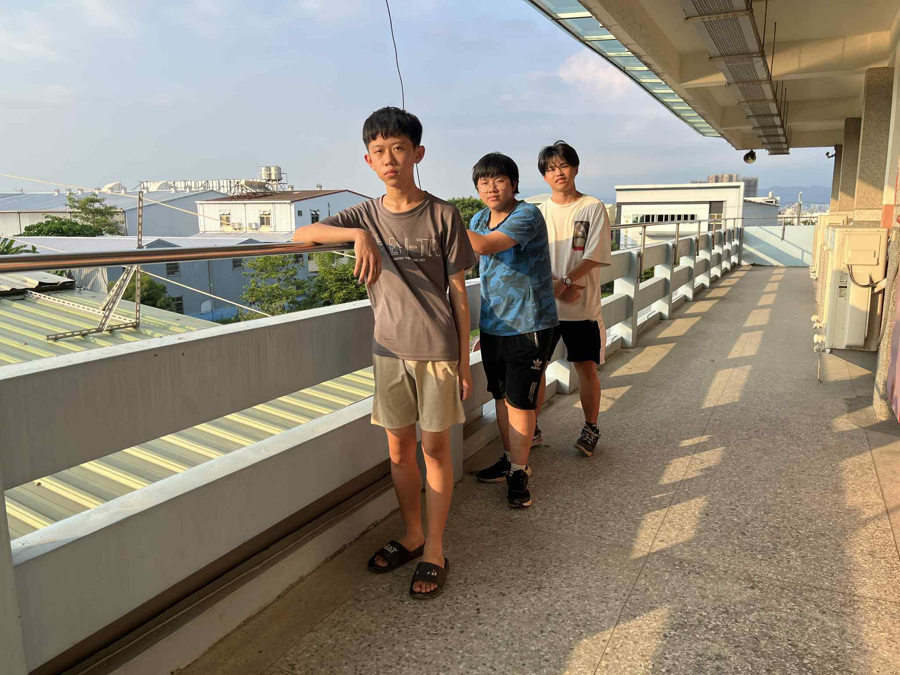
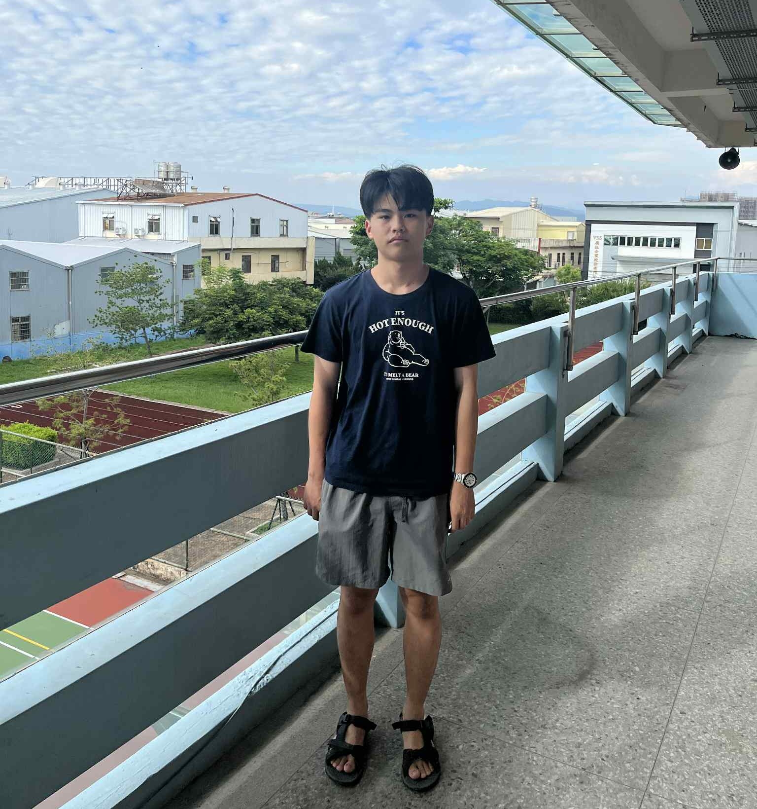
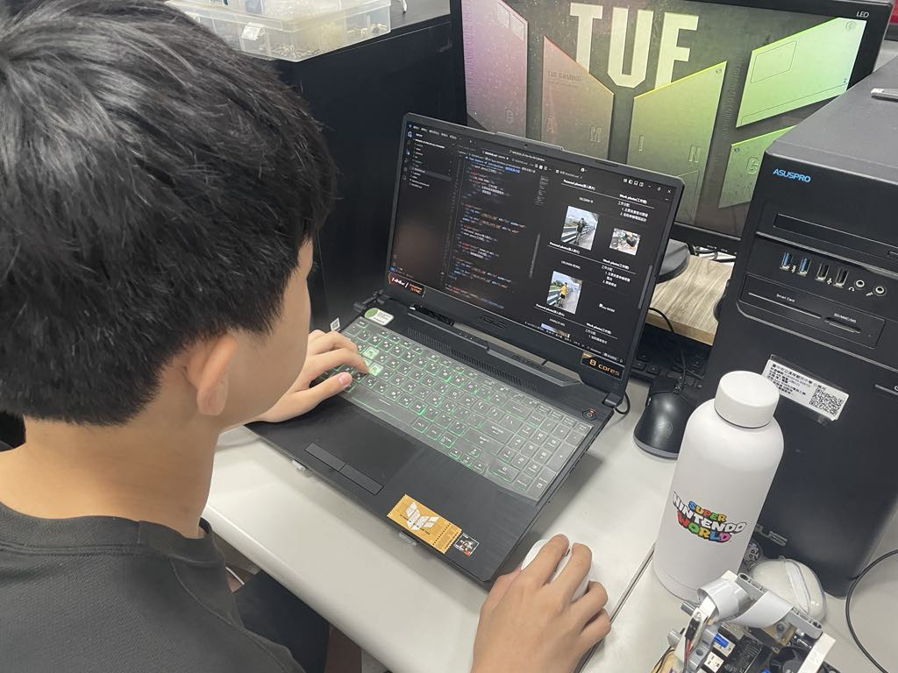
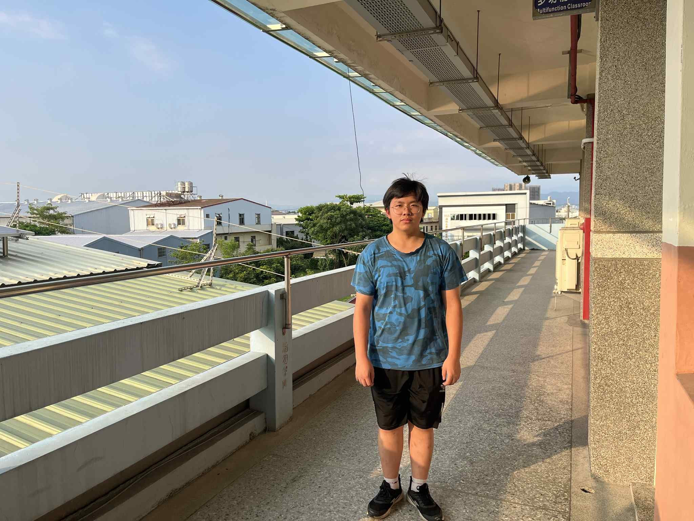

## 
 Team Members Introduction-團隊成員介紹

- ### Team Photo-團隊照片  
  - 團隊成立的第一天，我們選擇在學校三樓教室外的走廊，拍下這張珍貴的照片，作為我們共同參與競賽的起始紀念。
  - 為記錄國際賽備戰的歷程，我們於社團教室中拍攝了第二張團隊合影，作為新的紀念里程碑。
  - To commemorate the team's inaugural day, we captured this significant photo outside the third-floor classroom, symbolizing the start of our collective journey into competitions.
  - Capturing the journey toward the international competition, we held our second team photoshoot inside the club classroom, serving as a fresh commemorative milestone.

<table>
  <tr>
    <th align=center>Team Founding Commemorative Group Photo 團隊成立紀念團體合影</th>
    <th align=center>The First Commemorative Group Photo After Qualifying for the World Championship晉級世界賽首張紀念團體合影</th>
  </tr>
  <tr>
    <td></td>
    <td></td>
  </tr>
</table>

- ### Funny Photo-搞笑照片
  - 因為一時想不出更好的點子，我們三個只好並肩站成一排拍照留念。
  - Since we couldn't come up with any better ideas, the three of us simply stood in a line shoulder to shoulder for a commemorative photo.

 
  

## Team Members of Introduction -團隊成員介紹 

<table>
  <tr align="center">
     <th>Personal photo(個人照片)</th>
     <th>Work photo(工作照)</th>    
  </tr>
  <tr >
      <td align="center">HU,SIAN-YI</td>
      <td align="left">Work Assignments工作分配: 
         <ol><li>Primary responsibility for program development. 主要負責程式開發</li>
             <li>Assisting with vehicle electrical circuit design.協助車輛電路設計 </li>
         </ol>
      </td>
  </tr>

  <tr align="center">
      <td> </td>
      <td></td>
  </tr>
    <tr align="center">
     <th>Personal photo(個人照片)</th>
     <th>Work photo(工作照)</th>    
  </tr>
  <tr align="center">
     <td>LIN,JHAN-RONG</td>
     <td align="left">Work Assignments工作分配： 
         <ol><li>Primary responsibility for vehicle hardware integration.主要負責車輛硬體整合</li>
             <li>Assistance with report documentation and program debugging.協助撰寫報告及程式除錯 </li>
         </ol>
     </td>    
  </tr>

  <tr align="center">
      <td> </td>
      <td></td>
  </tr>
    <tr align="center">
     <th>Personal photo(個人照片)</th>
     <th>Work photo(工作照)</th>    
  </tr>
   <tr>
     <td align="center">JHANG,YI-WEI</td>
     <td align="left"> Work Assignments工作分配: 
         <ol>
            <li>Primary responsibility for engineering documentation authoring.主要負責工程文件撰寫。</li>
            <li>Assistance with vehicle hardware design.協助車輛硬體設計。</li>
          </ol>      

  </tr>

  <tr align="center">
      <td> </td>
      <td></td>
  </tr>
</table>

# 
[Return Home](../)
 

