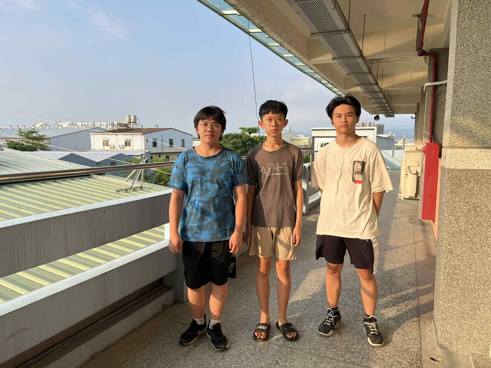
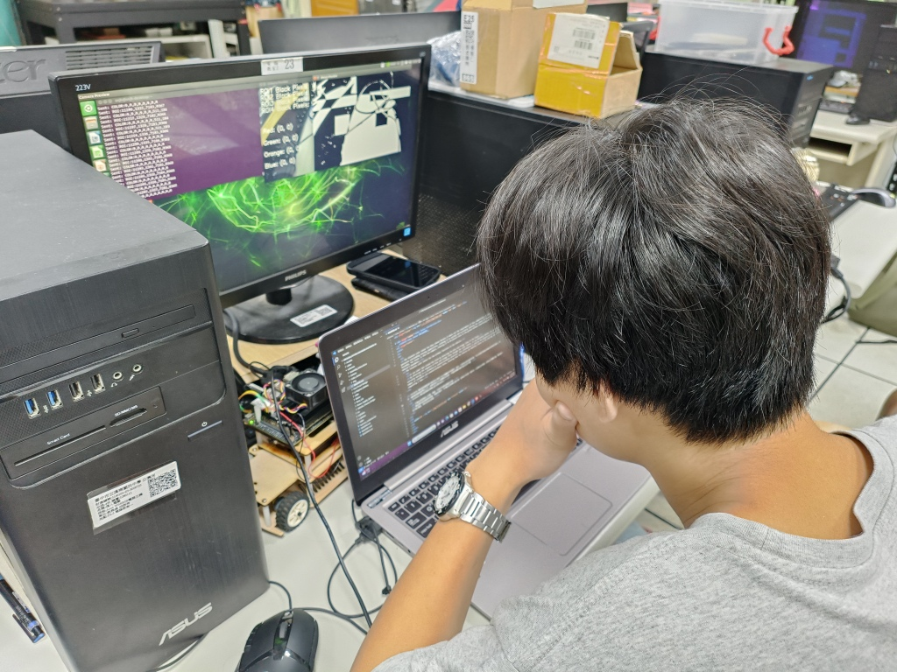
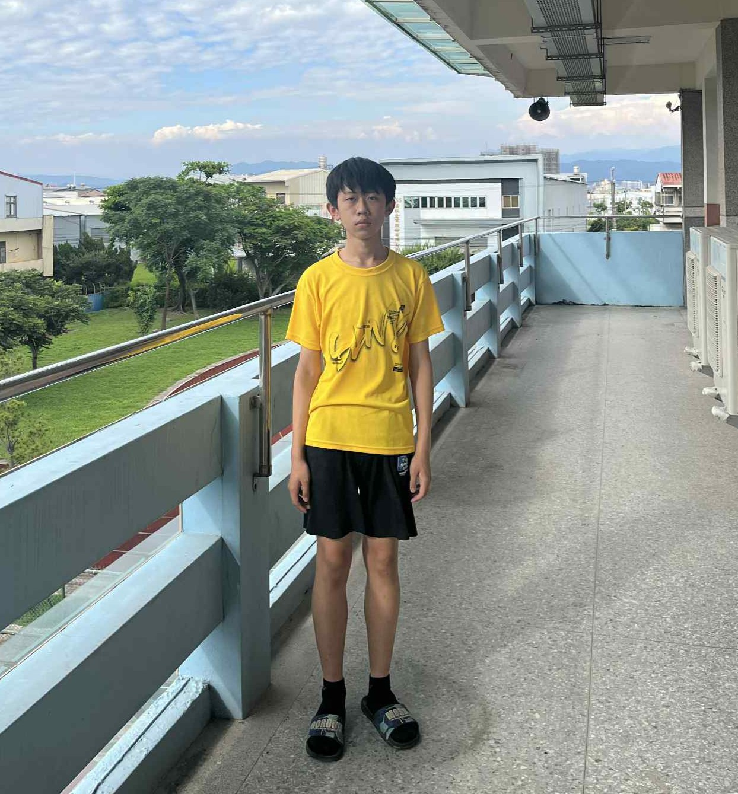

## 
 Team Members Introduction-團隊成員介紹

- ### Team Photo-團隊照片  
  - 今天是我們團隊成立的第一天，因此我拍了一張照片作為紀念。地點選在了三樓教室外面走廊。
  - Today is the first day of our team's establishment, so I took a photo as a souvenir. The location was chosen in the corridor outside the classroom on the third floor.

<table>
  <tr>
    <th align=center>團隊成立第一天</th>
    <th align=center>全國賽後第一周</th>
  </tr>
  <tr>
    <td></td>
    <td></td>
  </tr>
</table>

- ### Funny Photo-搞笑照片
  - 由於我們沒有想法我們三個就排成一排拍照
  - TSince we had no idea, the three of us lined up and took photos

 
  

## Team Members of Introduction -團隊成員介紹 

<table>
  <tr align="center">
     <th>Personal photo(個人照片)</th>
     <th>Work photo(工作照)</th>    
  </tr>
  <tr >
      <td align="center">HU,SIAN-YI</td>
      <td align="left">工作分配: 
         <ol><li>主要負責程式開發 </li>
             <li>協助車輛電路設計 </li>
         </ol>
      </td>
  </tr>

  <tr align="center">
      <td> </td>
      <td></td>
  </tr>
    <tr align="center">
     <th>Personal photo(個人照片)</th>
     <th>Work photo(工作照)</th>    
  </tr>
  <tr align="center">
     <td>LIN,JHAN-RONG</td>
     <td align="left">工作分配： 
         <ol><li>主要負責車輛硬體整合</li>
             <li> 撰寫報告 </li>
         </ol>
     </td>    
  </tr>

  <tr align="center">
      <td> </td>
      <td></td>
  </tr>
    <tr align="center">
     <th>Personal photo(個人照片)</th>
     <th>Work photo(工作照)</th>    
  </tr>
   <tr>
     <td align="center">JHANG,YI-WEI</td>
     <td align="left"> 工作分配: 
         <ol><li>協助編寫程式</li>
  </tr>

  <tr align="center">
      <td> </td>
      <td></td>
  </tr>
</table>

# 
[Return Home](../)
 

