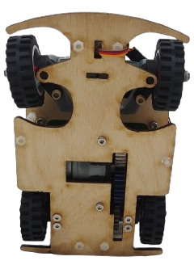

## 
 Vehicle's photos-車輛照片

- ### Vehicle's photos

<table>
  <tr align="center">
    <th>Top View(頂視圖）</th>
    <th>Bottom View（底視圖） </th>
  </tr>
    <tr align="center">
    <td> </td>
    <td></td>

  </tr>
    <tr align="center">
    <th>Front view（正視圖) </th>
    <th>Rear view(後視圖)</th>
  </tr>
    </tr>
    <tr align="center">
    <td></td>
    <td></td>
  </tr>
  </tr>
    <tr align="center">
    <th>Left view (左視圖)</th>
    <th>Right view(右視圖)</th>
  </tr>
    </tr>
    <tr align="center">
    <td></td>
    <td></td>
  </tr>
</table>

 

- ### Vehicle Body Structure Display Diagram-車身結構展示圖
  

  <table>
    <tr>
    <th>Top View of the Overall Apparatus(整體裝置的頂視圖)
    </th>
    <th>Middle Layer Structure Top View(中間層結構頂視圖)</th>
    <th>Top View of Vehicle Chassis(車輛底盤頂視圖)</th>
    <th>Bottom View of Vehicle Chassis(車輛底盤仰視圖)</th>
    </tr>
    <tr align="center">
      <td>  
      </td>
      <td>
      </td>
      <td>
      </td>
      <td></td>
    </tr>
  </table>
  

- ### Circuit Board-電路板
    

    <table>
      <tr align="center">
          <th> Circuit Board Top View(電路板頂視圖)
          </th><th>Circuit Board Button View(電路板按鈕視圖)</th>
      </tr>
      <tr align="center">
        <td>  </td><td></td>
      </tr>
    </table>
    

# 
[Return Home](../)
 
