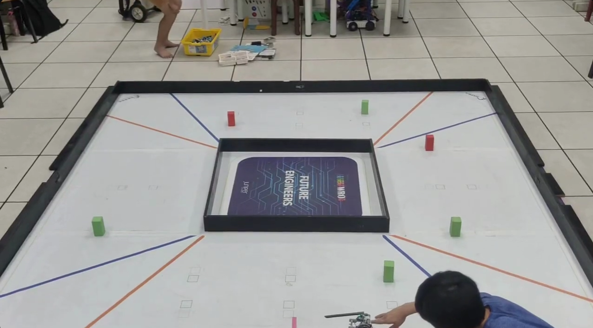
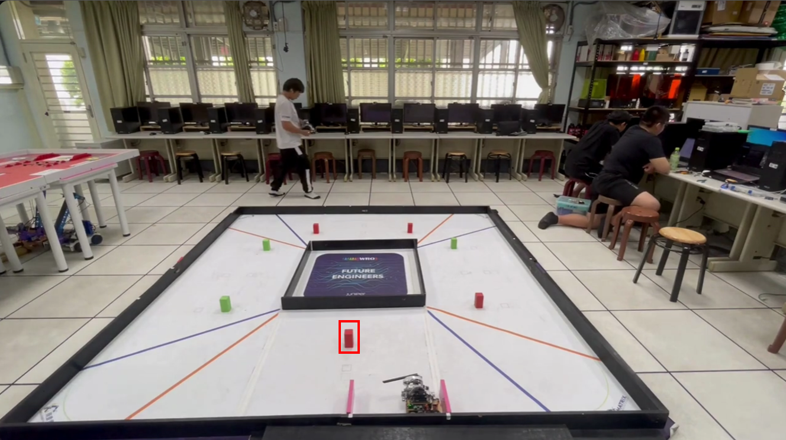

## 
Testing Video of Self-Driving Car in Obstacle Challenge-自駕車在障礙挑戰中的測試影片

- #### The last traffic light on the second lap is a green signal.(No need to turn around )-第二圈的最後一個紅綠燈是綠燈訊號。（無需掉頭）
  這是一段車輛第二圈行駛的測試影片，最後一個紅綠燈為綠燈。

  Here is a test video of a vehicle on the second lap, with the last traffic light being green. 
  

  <table >
    <tr >
       <th align="center">The last traffic light on the second lap is a green signal-第二圈的最後一個紅綠燈是綠燈訊號。</th>

    </tr>
    <tr >
       <td  width="500" > </td>

    </tr>
    </table>  
    

- #### The last traffic light on the second lap is red.(Need to turn around)-第二圈的最後一個紅綠燈是紅燈訊號。（需要掉頭）
  以下是第二圈最後一個紅綠燈在不同位置的測試影片。
  
  Here are test videos of the last traffic light being red in different positions on the second lap.  

  

  <table >
    <tr >
       <th align="center">At Position 1</th>
       <th align="center">At Position 2</th>
       <th align="center">At Position 3</th>
    </tr>
    <tr >
       <td  width="500" > </td>
       <td  width="500" > </td>
       <td  width="500" > </td>
    </tr>
    </table>  
    

- #### Video of parking tests at different positions.-不同位置停車測試的影片。
  
  

  <table >
    <tr >
       <th align="center">Position is on the Left-位置在左邊</th>
       <th align="center">Position is at the top-位置在頂部</th>
       <th align="center">Position is on the right-位置在右邊</th>
       <th align="center">Position is at the bottom-位置在底部</th>
    </tr>
    <tr >
       <td  width="500" > </td>
       <td  width="500" > </td>
       <td  width="500" > </td>
       <td  width="500" > </td>
    </tr>
    </table>  
    

# 
[Return Home](../../)
  

