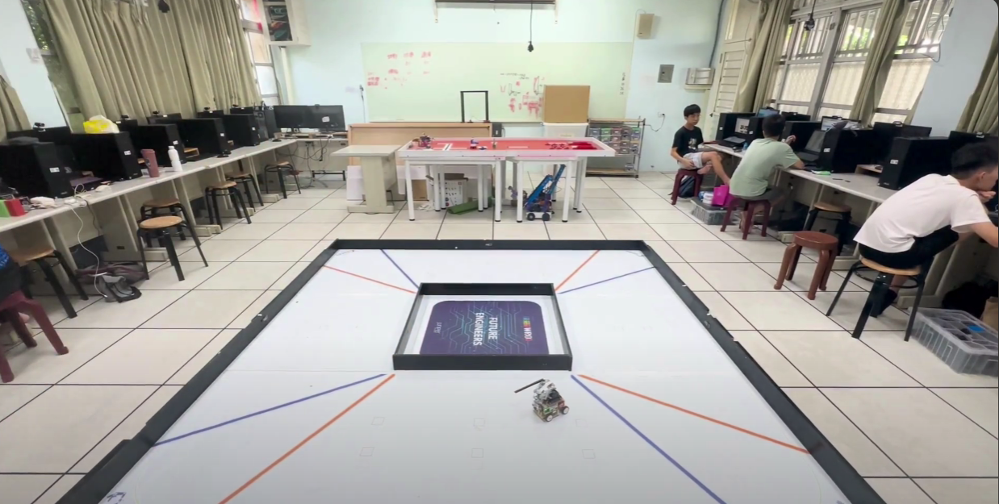
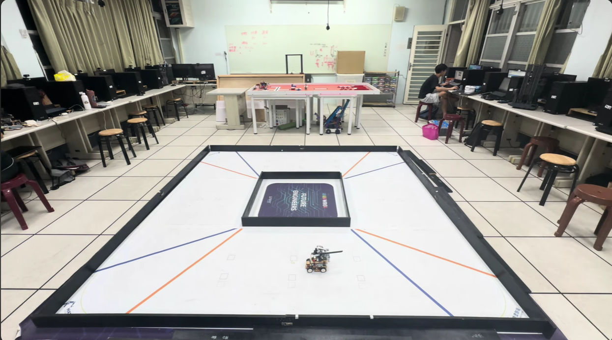
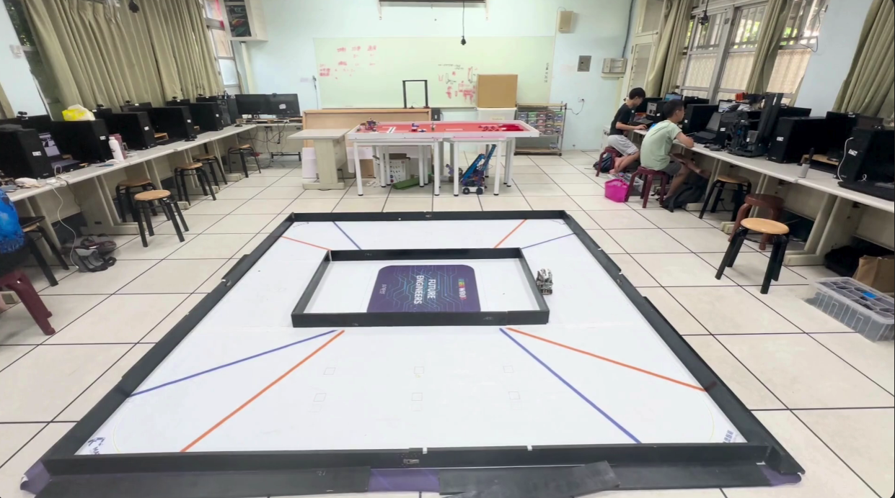
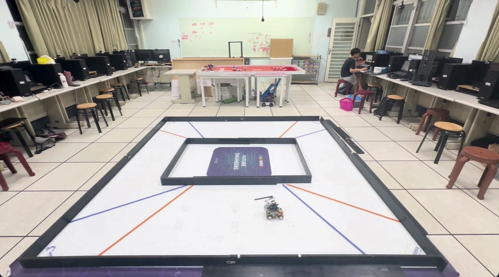
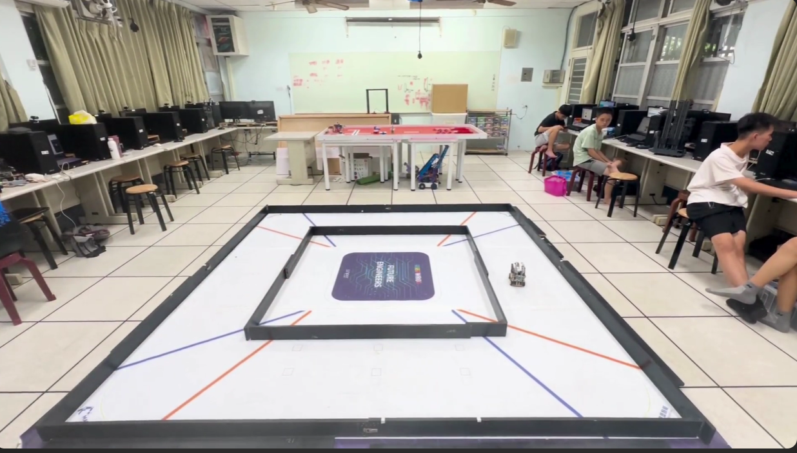
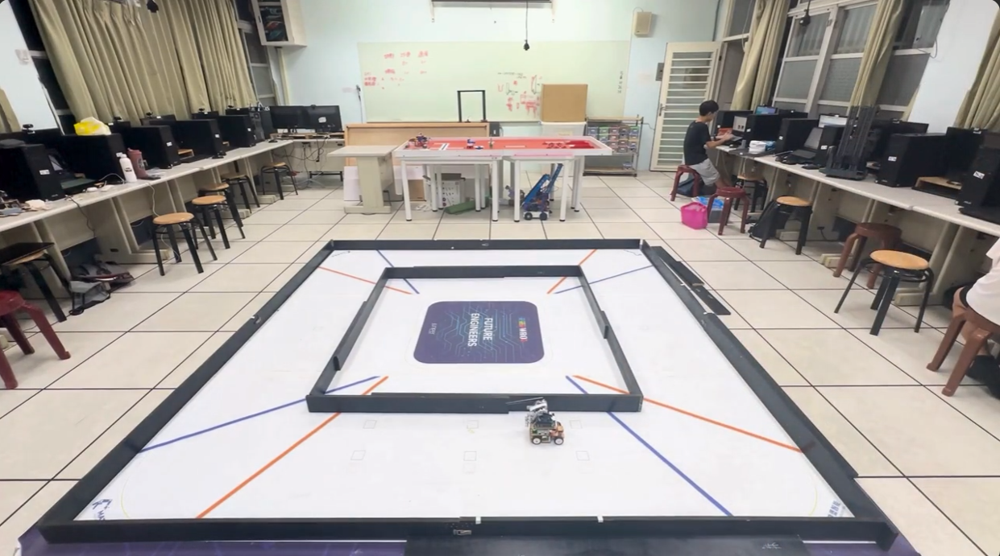
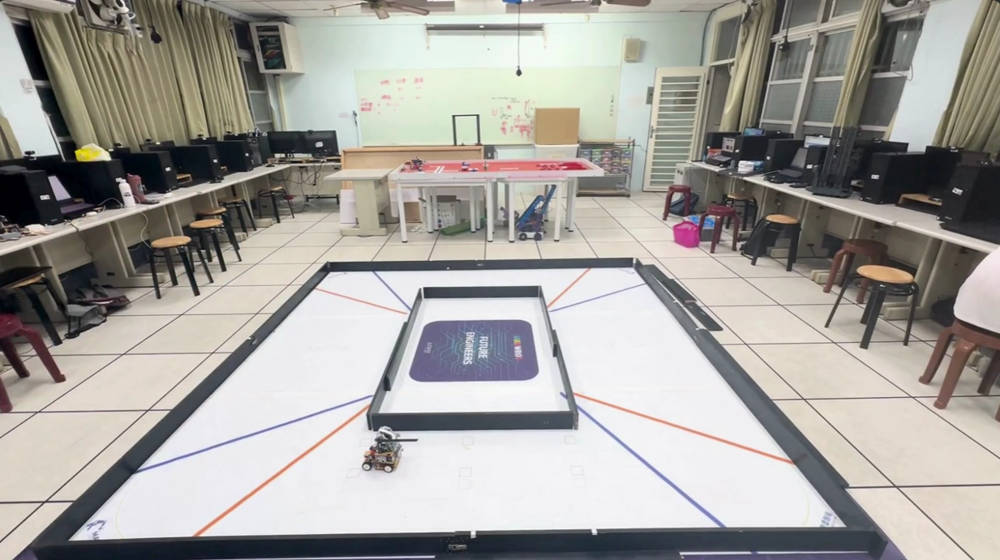
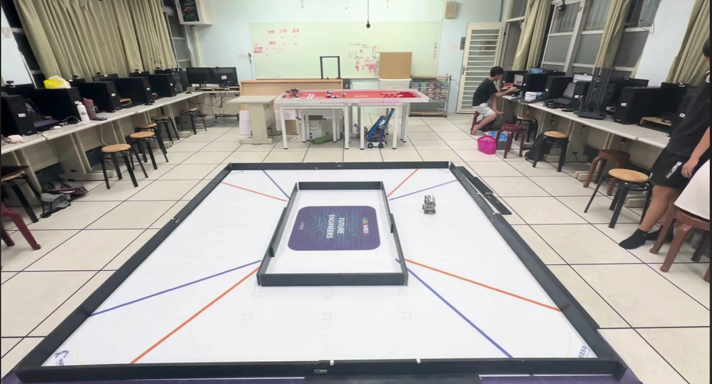

## 
Testing Video of Self-Driving Car in Open Challenge-自駕車在開放挑戰中的測試影片
 
  以下是不同動力和場地組合的車輛測試影片。

  Here are test videos of vehicles in different power and field combinations.

- ### Full width

  This is a test video of a vehicle in a field set to "wide-wide-wide-wide", recorded clockwise and counterclockwise.
<table>
  <tr align="center">
     <th>clockwise</th>
     <th>counterclockwise</th>    
  </tr>
  <tr >
     <td width="40%"> </td>
     <td width="40%"></td>
  </tr>
  </table>

- ### Wide-Narrow-Wide-Narrow

  This is a test video of a vehicle in a field set to "wide-narrow-wide-narrow", recorded clockwise and counterclockwise.
<table>
  <tr align="center">
     <th>Shun</th>
     <th>counterclockwise</th>    
  </tr>
  <tr >
     <td width="40%"> </td>
     <td width="40%"></td>
  </tr>
  </table>

- ### Full narrow

  This is a test video of a vehicle in a field set to 'narrow-narrow-narrow-narrow', recorded clockwise and counterclockwise.
<table>
  <tr align="center">
     <th>Power 50</th>
     <th>counterclockwise</th>    
  </tr>
  <tr >
     <td width="40%"> </td>
     <td width="40%"></td>
  </tr>
  </table>  

- ### wide narrow wide narrow

  These are test videos of a vehicle in a "wide-narrow-wide-narrow", recorded clockwise and counterclockwise.
<table>
  <tr align="center">
     <th>Clockwise</th>
     <th>counterclockwise</th>    
  </tr>
  <tr >
     <td width="40%"> </td>
     <td width="40%"></td>
  </tr>
  </table>  

- ### Wide Wide Narrow Narrow

This is a test video of a vehicle in a field set to "wide-wide-narrow-narrow", recorded clockwise and counterclockwise.

  <table>
    <tr align=center>
      <th>Clockwise</th>
      <th>counterclockwise</th>
    </tr>
    <tr>
      <td align=center width=40%></td>
      <td align=center width=40%></td>
    </tr>
  </table>

- ### Narrow Narrow Wide Wide

This is a test video of a vehicle in a field set to "narrow-narrow-wide-wide", recorded clockwise and counterclockwise.

  <table>
    <tr align=center>
      <th>Clockwise</th>
      <th>counterclockwise</th>
    </tr>
    <tr>
      <td align=center width=40%></td>
      <td align=center width=40%></td>
    </tr>
  </table>

- ### Wide Narrow Narrow Narrow

This is a test video of a vehicle in a field set to "wide-narrow-narrow-narrow", recorded clockwise and counterclockwise.

  <table>
    <tr align=center>
      <th>Clockwise</th>
      <th>counterclockwise</th>
    </tr>
    <tr>
      <td align=center width=40%></td>
      <td align=center width=40%></td>
    </tr>
  </table>

- ### Narrow Wide Wide Wide

This is a test video of a vehicle in a field set to "Narrow Wide Wide Wide", recorded clockwise and counterclockwise.

  <table>
    <tr align=center>
      <th>Clockwise</th>
      <th>counterclockwise</th>
    </tr>
    <tr>
      <td align=center width=40%></td>
      <td align=center width=40%></td>
    </tr>
  </table>

# 
[Return Home](../../)
