

## 
Testing Video of Self-Driving Car in Open Challenge rounds
 

### Here is the test video of the competition track width variations.
- ### Full narrow
  This is a test video of a vehicle in a field set to 'narrow-narrow-narrow-narrow', recorded clockwise and counterclockwise.
  

    <table>
      <tr align="center">
       <th>Clockwise</th>
       <th>Counterclockwise</th>    
      </tr>
      <tr >
       <td width="40%"> </td>
       <td width="40%"><a href="https://youtu.be/30k0c0JbF3A">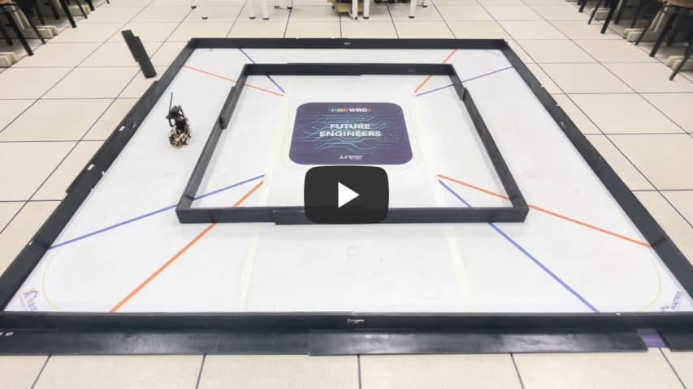</a></td>
      </tr>
    </table>
  

- ### Narrow Wide Wide Wide
  This is a test video of a vehicle in a field set to "Narrow Wide Wide Wide", recorded clockwise and counterclockwise.
  

    <table>
      <tr align=center>
       <th>Clockwise</th>
       <th>Counterclockwise</th>
      </tr>
      <tr>
       <td align=center width="40%"><a href="https://youtu.be/rn5UsgO7_QA">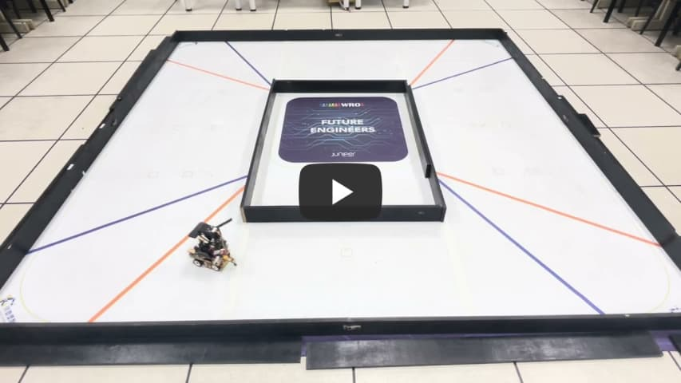</a></td>
       <td align=center width="40%"><a href="https://youtu.be/zKaRvkeFm-4">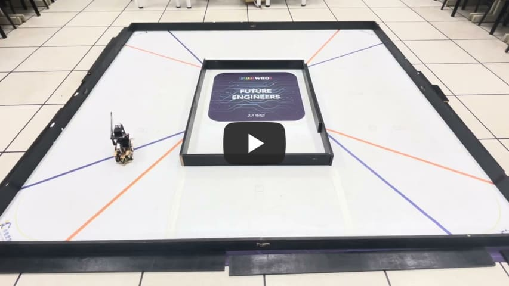</a></td>
      </tr>
    </table>
  

- ### Narrow Wide Narrow Wide

  This is a test video of a vehicle in a field set to "narrow wide narrow wide", recorded clockwise and counterclockwise.
  

    <table>
      <tr align="center">
       <th>Clockwise</th>
       <th>Counterclockwise</th>
      </tr>
      <tr >
       <td width="40%"><a href="https://youtu.be/GNtNA6J2SKY">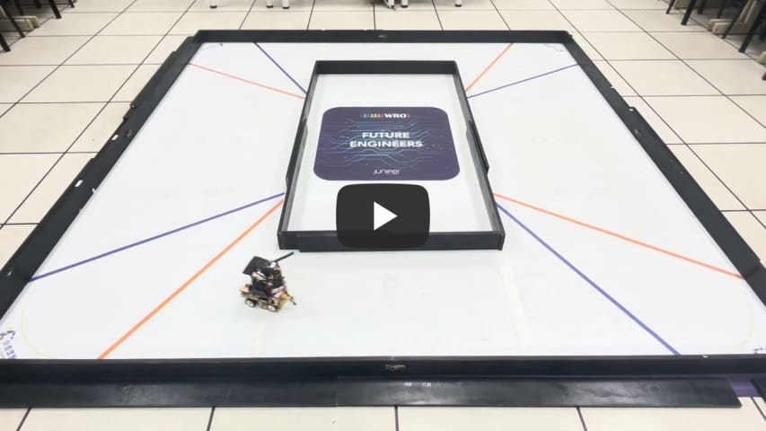</a> </td>
       <td width="40%"><a href="https://youtu.be/w7hL-hwOTlY">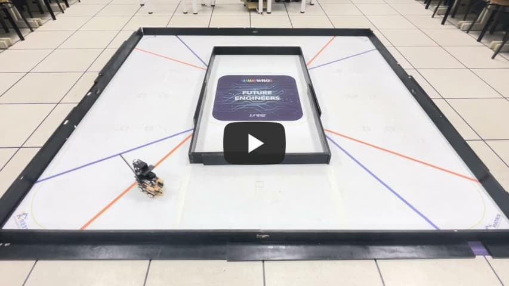</a></td>
      </tr>
    </table>
  

- ### Wide Narrow Wide Narrow

  These are test videos of a vehicle in a field set to "wide-narrow-wide-narrow", recorded clockwise and counterclockwise.
  

    <table>
      <tr align="center">
       <th>Clockwise</th>
       <th>Counterclockwise</th>    
      </tr>
      <tr >
       <td width="40%"><a href="https://youtu.be/-3bPgdEguyA">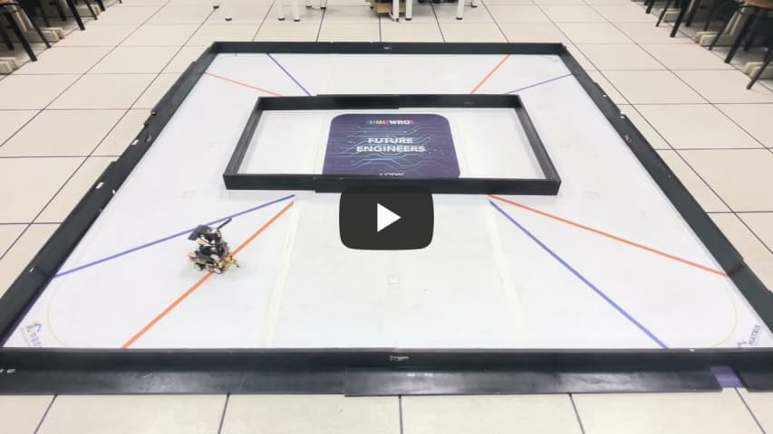</a> </td>
       <td width="40%"><a href="https://youtu.be/j9UDgFQ8udI">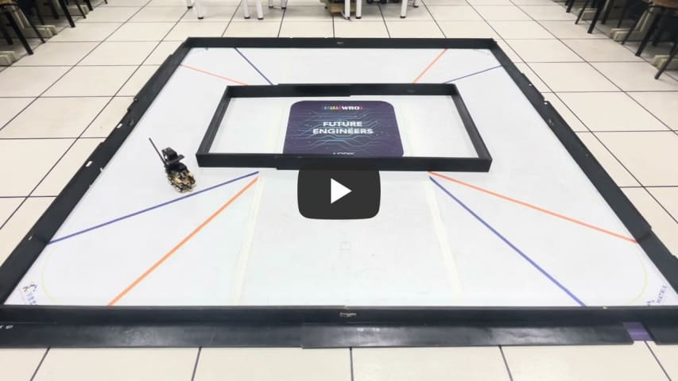</a></td>
      </tr>
    </table>
  

- ### Wide Wide Narrow Narrow

  This is a test video of a vehicle in a field set to "wide-wide-narrow-narrow", recorded clockwise and counterclockwise.
  

    <table>
      <tr align=center>
      <th>Clockwise</th>
      <th>Counterclockwise</th>
      </tr>
      <tr>
      <td width="40%"><a href="https://youtu.be/lICgnjzpW08">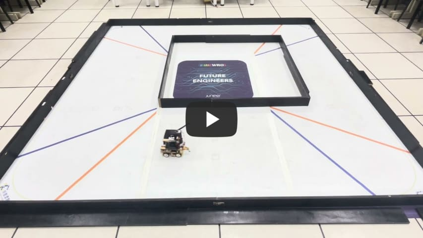</a> </td>
      <td width="40%"><a href="https://youtu.be/rf_sjSUVRaA">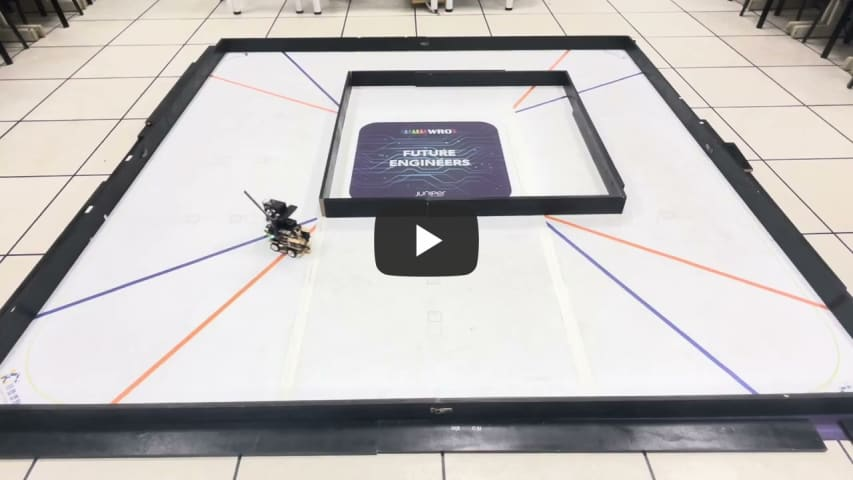</a></td>
      </tr>
    </table>
  

- ### Narrow Narrow Wide Wide

  This is a test video of a vehicle in a field set to "narrow-narrow-wide-wide", recorded clockwise and counterclockwise.
  

    <table>
      <tr align=center>
      <th>Clockwise</th>
      <th>Counterclockwise</th>
      </tr>
      <tr>
      <td width="40%"><a href="https://youtu.be/ywlkTwc3BKk">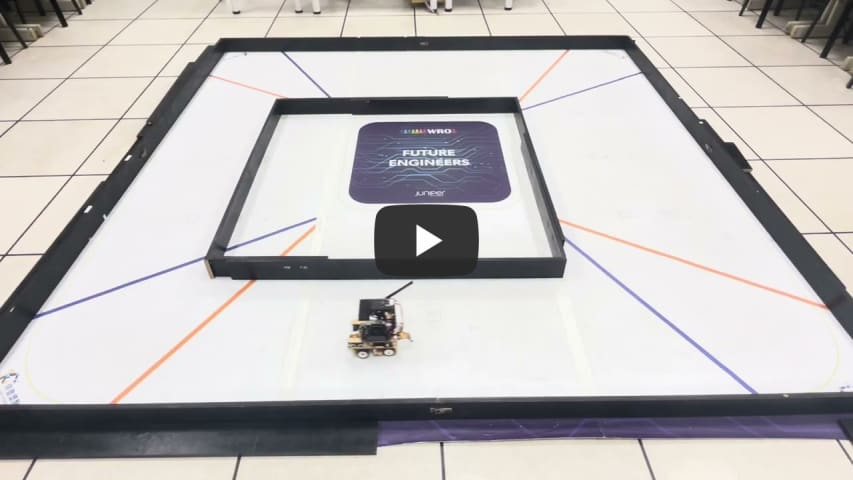</a> </td>
      <td width="40%"><a href="https://youtu.be/J0V3LCfGXgI">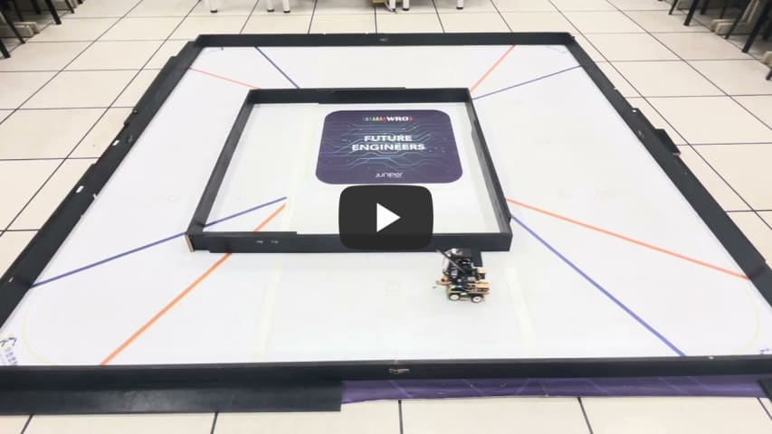</a></td>
      </tr>
    </table>
  

- ### Wide Narrow Narrow Narrow

  This is a test video of a vehicle in a field set to "wide-narrow-narrow-narrow", recorded clockwise and counterclockwise.
    

    <table>
    <tr  align="center">
    <th>Clockwise</th>
    <th>Counterclockwise</th>
    </tr>
    <td align=center width=40%><a href="https://youtu.be/y2OTN4GNG0c">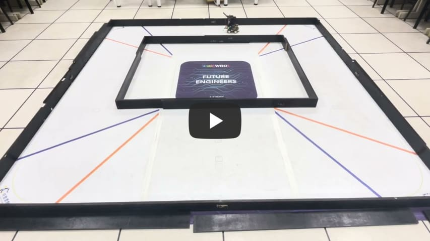</a></td>
    <td align=center width=40%><a href="https://youtu.be/cj5GPhtg8dU">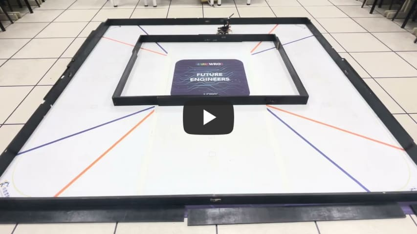</a></td>
    </table>  
    

- ### Full wide
  This is a test video of a vehicle in a field set to "wide-wide-wide-wide", recorded clockwise and counterclockwise.
  

    <table>
      <tr align="center">
      <th>Clockwise</th>
      <th>Counterclockwise</th>    
      </tr>
      <tr >
       <td width="40%"><a href="https://youtu.be/G9K3tHob7iE">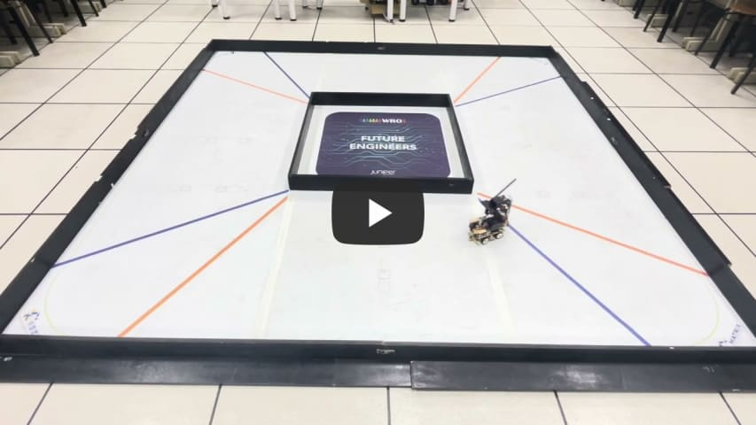</a> </td>
       <td width="40%"><a href="https://youtu.be/5vnI3IxLeD8">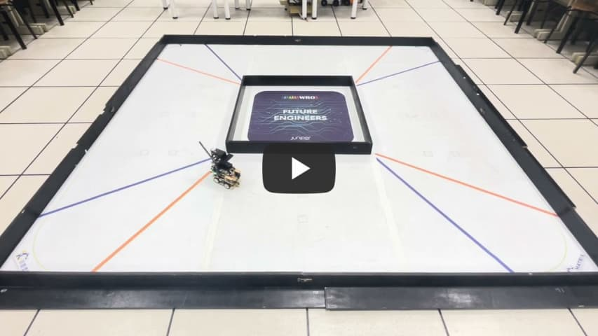</a></td>
      </tr>
    </table>
  

# 
[Return Home](../../)

